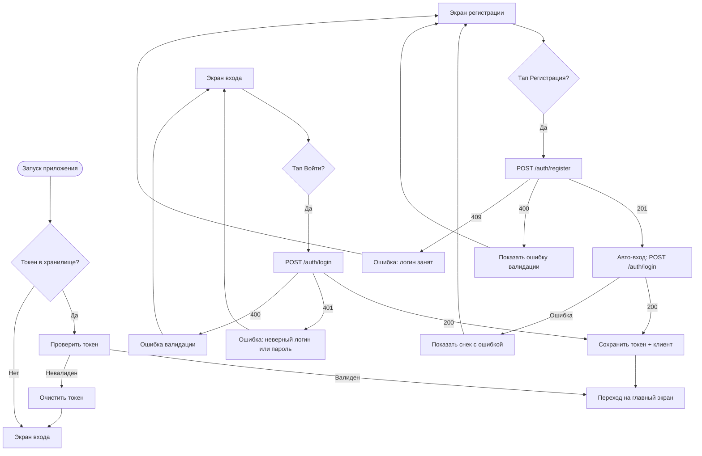

# Аутентификация

**ID:** LOGIC-001  
**Тип:** Логика  
**Домен:** 09. Логики  
**Приоритет:** Critical  
**Статус:** Актуален  
**Функциональные блоки:** FT-01, FT-02

---

## История изменений

| Релиз | ТЗ | Описание изменений |
|-------|-----|-------------------|
| 1.0.0 | [ТЗ на мобильное приложение гончарной мастерской](./_INDEX.md) | Первоначальная документация |

---

## Входные данные

| Название | Тип | Возможные значения | Описание |
|----------|-----|-------------------|----------|
| `token` | Защищённое хранилище | Любой JWT-токен | Сохранённый токен авторизации пользователя |
| `isAuthenticated` | Состояние | `true`, `false` | Флаг авторизации клиента в текущей сессии |
| `clientData` | Кэш | Объект Client | Кэшированные данные текущего клиента |

---

## Обзор

Аутентификация обеспечивает регистрацию новых и вход существующих клиентов в приложение. При успешной регистрации происходит автоматический вход. Токен сохраняется в защищённое хранилище, данные клиента — в кэш. При запуске приложения проверяется наличие токена для автоматического входа.

### User Story

> Как клиент, я хочу регистрироваться и входить в приложение, чтобы управлять бронями и записываться на занятия.

### Бизнес-ценность

- Обеспечивает персонализацию и историю броней для каждого клиента
- Позволяет разграничить доступ к личным данным и действующим броням

---

## Точки применения

| Экран/Компонент | Элемент/Триггер | Условие |
|-----------------|-----------------|---------|
| SCR-001 Вход | Кнопка "Войти" | Заполнены все поля формы |
| SCR-002 Регистрация | Кнопка "Зарегистрироваться" | Заполнены все поля формы и пароль ≥ 6 символов |
| Launch (запуск приложения) | При открытии | В защищённом хранилище есть токен |

---

## Флоу

---

## API запросы

### POST /auth/register

**Триггер:** Тап на кнопку "Зарегистрироваться"

**Headers:**

| Поле | Описание |
|------|----------|
| `Content-Type` | `application/json` |

**Body:**

| Параметр | Тип | Описание | Значение/Источник |
|----------|-----|----------|-------------------|
| `login` | string | Логин нового пользователя | Из поля ввода логина |
| `password` | string | Пароль (минимум 6 символов) | Из поля ввода пароля |

**Обработка ответа:**

| Результат | Действие |
|-----------|----------|
| Загрузка | Лоадер на кнопке "Зарегистрироваться" |
| Успех (201) | Автоматический вход: выполнить POST /auth/login с теми же логином и паролем |
| Ошибка 400 | Снек с текстом ошибки из ответа сервера |
| Ошибка 409 | Снек "Этот логин уже занят" |
| Ошибка 5xx | Снек "Произошла ошибка. Попробуйте позже" |
| Ошибка сети | Снек "Нет соединения. Проверьте подключение к интернету" |

### POST /auth/login

**Триггер:** Тап на кнопку "Войти"

**Headers:**

| Поле | Описание |
|------|----------|
| `Content-Type` | `application/json` |

**Body:**

| Параметр | Тип | Описание | Значение/Источник |
|----------|-----|----------|-------------------|
| `login` | string | Логин пользователя | Из поля ввода логина |
| `password` | string | Пароль | Из поля ввода пароля |

**Обработка ответа:**

| Результат | Действие |
|-----------|----------|
| Загрузка | Лоадер на кнопке "Войти" |
| Успех (200) | Сохранить `token` в защищённое хранилище, `client` в кэш, установить `isAuthenticated = true`, перейти на главный экран |
| Ошибка 401 | Снек "Неверный логин или пароль" |
| Ошибка 400 | Снек с текстом ошибки из ответа сервера |
| Ошибка 5xx | Снек "Произошла ошибка. Попробуйте позже" |
| Ошибка сети | Снек "Нет соединения. Проверьте подключение к интернету" |

---

## Локальное хранение

| Ключ | Тип хранения | Описание |
|------|--------------|----------|
| `token` | Защищённое хранилище | JWT-токен для авторизации запросов |
| `client` | Кэш | Данные текущего клиента (ID, логин, дата создания) |

---

## Связанные требования

### Функциональные (REQ-FUNC-*)

| ID | Название | Приоритет |
|----|----------|-----------|
| FT-01 | Регистрация пользователя | Critical |
| FT-02 | Вход пользователя | Critical |

---

## Критерии приёмки

| ID | Критерий |
|----|----------|
| AC-001 | **Дано** пользователь на экране регистрации, **Когда** он вводит валидные логин и пароль (≥ 6 символов) и нажимает "Зарегистрироваться", **Тогда** выполняется регистрация, затем автоматический вход, токен сохраняется, и пользователь переходит на главный экран |
| AC-002 | **Дано** пользователь на экране входа, **Когда** он вводит верные логин и пароль и нажимает "Войти", **Тогда** токен сохраняется, и пользователь переходит на главный экран |
| AC-003 | **Дано** пользователь на экране входа, **Когда** он вводит неверные логин или пароль, **Тогда** отображается снек "Неверный логин или пароль" |
| AC-004 | **Дано** пользователь на экране регистрации, **Когда** он вводит уже занятый логин, **Тогда** отображается снек "Этот логин уже занят" |
| AC-005 | **Дано** приложение запускается, **Когда** в защищённом хранилище есть валидный токен, **Тогда** пользователь автоматически переходит на главный экран |
| AC-006 | **Дано** приложение запускается, **Когда** в защищённом хранилище нет токена, **Тогда** пользователь видит экран входа |
