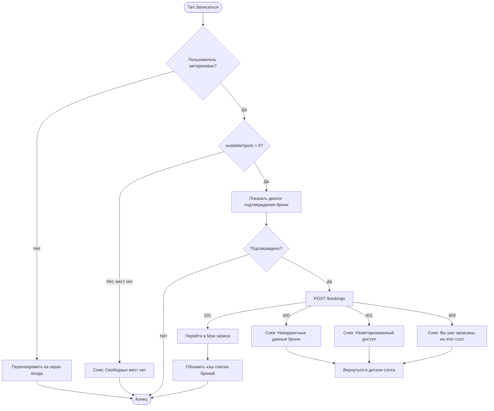

# Бронирование с прокатом

**ID:** LOGIC-004  
**Тип:** Логика  
**Домен:** 09. Логики  
**Приоритет:** Critical  
**Статус:** Актуален  
**Функциональные блоки:** FT-04

---

## История изменений

| Релиз | ТЗ | Описание изменений |
|-------|-----|-------------------|
| 1.0.0 | [ТЗ на мобильное приложение гончарной мастерской](./_INDEX.md) | Первоначальная документация |

---

## Входные данные

| Название | Тип | Возможные значения | Описание |
|----------|-----|-------------------|----------|
| `slotId` | Состояние | UUID слота | ID выбранного слота из расписания |
| `rentalSelected` | Состояние | `true`, `false` | Флаг необходимости проката инструментов |
| `availableSpots` | Состояние | Число ≥ 0 | Количество свободных мест в слоте |

---

## Обзор

Клиент выбирает слот из расписания, при необходимости отмечает опцию проката инструментов и создаёт бронь. Перед отправкой проверяется доступность мест (availableSpots > 0). При успехе клиент переходит на экран "Мои записи". При двойной брони одного слота сервер возвращает 409.

### User Story

> Как клиент, я хочу записаться на слот с опцией проката инструментов, чтобы гарантировать место на занятии.

### Бизнес-ценность

- Обеспечивает запись на занятия, основной конверсионный сценарий приложения
- Опция проката инструментов увеличивает средний чек мастерской
- Контроль свободных мест предотвращает переполнение групп

---

## Точки применения

| Экран/Компонент | Элемент/Триггер | Условие |
|-----------------|-----------------|---------|
| SCR-004 Детали слота | Переключатель "Прокат инструментов" | Слот поддерживает прокат (`rentalAvailable = true`) |
| SCR-004 Детали слота | Кнопка "Записаться" | `availableSpots > 0` и пользователь авторизован |

---

## Флоу

---

## API запросы

### POST /bookings

**Триггер:** Тап на кнопку "Записаться" после подтверждения

**Headers:**

| Поле | Описание |
|------|----------|
| `authorization` | Bearer токен пользователя |
| `Content-Type` | `application/json` |

**Body:**

| Параметр | Тип | Описание | Значение/Источник |
|----------|-----|----------|-------------------|
| `slotId` | string | ID выбранного слота | Из данных экрана "Детали слота" |
| `rentalSelected` | bool | Флаг проката инструментов | Из переключателя на экране (по умолчанию `false`) |

**Обработка ответа:**

| Результат | Действие |
|-----------|----------|
| Загрузка | Лоадер на кнопке "Записаться" |
| Успех (201) | Добавить новую бронь в кэш списка броней, перейти на экран SCR-005 "Мои записи" |
| Ошибка 400 | Снек с текстом ошибки из ответа сервера |
| Ошибка 401 | Снек "Неавторизованный доступ. Выполните вход" |
| Ошибка 409 | Снек "Вы уже записаны на этот слот" |
| Ошибка 5xx | Снек "Произошла ошибка. Попробуйте позже" |
| Ошибка сети | Снек "Нет соединения. Проверьте подключение к интернету" |

---

## Локальное хранение

| Ключ | Тип хранения | Описание |
|------|--------------|----------|
| `bookingsCache` | Кэш | Список броней текущего клиента для быстрого отображения без повторного запроса |

---

## Связанные требования

### Функциональные (REQ-FUNC-*)

| ID | Название | Приоритет |
|----|----------|-----------|
| FT-04 | Бронирование слота | Critical |

---

## Критерии приёмки

| ID | Критерий |
|----|----------|
| AC-001 | **Дано** авторизованный клиент на экране "Детали слота", **Когда** доступны свободные места, клиент нажимает "Записаться" и подтверждает, **Тогда** создаётся бронь, и клиент переходит на экран "Мои записи" |
| AC-002 | **Дано** неавторизованный клиент на экране "Детали слота", **Когда** он нажимает "Записаться", **Тогда** происходит перенаправление на экран входа |
| AC-003 | **Дано** на слоте нет свободных мест, **Когда** клиент пытается записаться, **Тогда** показывается снек "Свободных мест нет" |
| AC-004 | **Дано** клиент уже записан на слот, **Когда** он повторно нажимает "Записаться", **Тогда** сервер возвращает 409 и показывается снек "Вы уже записаны на этот слот" |
| AC-005 | **Дано** клиент на экране "Детали слота", **Когда** слот поддерживает прокат, **Тогда** отображается переключатель "Прокат инструментов" со значением по умолчанию `false` |
