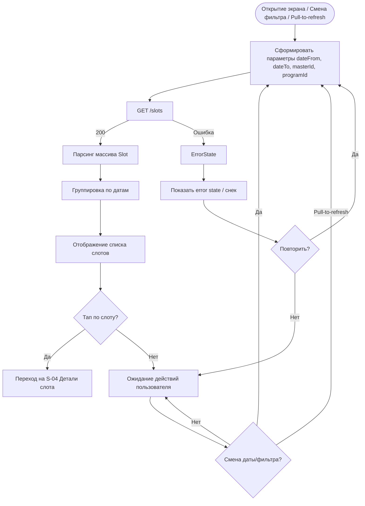

# Загрузка и фильтрация расписания

**ID:** LOGIC-005  
**Тип:** Логика  
**Домен:** 09. Логики  
**Приоритет:** Critical  
**Статус:** Актуален  
**Функциональные блоки:** FT-03

---

## История изменений

| Релиз | ТЗ | Описание изменений |
|-------|-----|-------------------|
| 1.0.0 | [ТЗ на мобильное приложение гончарной мастерской](./_INDEX.md) | Первоначальная документация |

---

## Входные данные

| Название | Тип | Возможные значения | Описание |
|----------|-----|-------------------|----------|
| `dateFrom` | Состояние | Дата ISO (YYYY-MM-DD) | Начальная дата отображения расписания (по умолчанию — сегодня) |
| `dateTo` | Состояние | Дата ISO (YYYY-MM-DD) | Конечная дата отображения (по умолчанию сегодня + 7 дней) |
| `selectedMasterId` | Состояние | UUID / `null` | Фильтр по конкретному мастеру |
| `selectedProgramId` | Состояние | UUID / `null` | Фильтр по конкретной программе |

---

## Обзор

Логика загружает расписание слотов на 7 дней (по умолчанию), отображает их в виде списка. Клиент может фильтровать слоты по мастеру и/или программе. При тапе на слот открывается экран деталей слота. Поддерживается pull-to-refresh для обновления данных.

### User Story

> Как клиент, я хочу просматривать расписание занятий с фильтрацией по мастеру и программе, чтобы выбрать удобный слот для записи.

### Бизнес-ценность

- Основной экран навигации по доступным занятиям
- Фильтрация ускоряет поиск подходящего слота
- Отображение на 7 дней вперёд даёт клиенту планировать посещения

---

## Точки применения

| Экран/Компонент | Элемент/Триггер | Условие |
|-----------------|-----------------|---------|
| SCR-003 Расписание | При открытии экрана | Всегда |
| SCR-003 Расписание | Выбор даты | Смена дня в календаре |
| SCR-003 Расписание | Pull-to-refresh | Всегда |
| SCR-003 Расписание | Фильтр по мастеру | Выбор мастера в фильтре |
| SCR-003 Расписание | Фильтр по программе | Выбор программы в фильтре |

---

## Флоу

---

## API запросы

### GET /slots

**Триггер:** Инициализация экрана, смена даты, смена фильтра, pull-to-refresh

**Headers:**

| Поле | Описание |
|------|----------|
| `authorization` | Bearer токен пользователя (если авторизован) |

**Параметры:**

| Параметр | Тип | Описание | Значение/Источник |
|----------|-----|----------|-------------------|
| `dateFrom` | string | Начальная дата (ISO 8601, YYYY-MM-DD) | Выбранная дата в календаре или текущая дата |
| `dateTo` | string | Конечная дата (ISO 8601, YYYY-MM-DD) | dateFrom + 7 дней по умолчанию |
| `masterId` | string (опц.) | ID мастера для фильтрации | Из выбранного фильтра по мастеру (если задан) |
| `programId` | string (опц.) | ID программы для фильтрации | Из выбранного фильтра по программе (если задан) |

**Обработка ответа:**

| Результат | Действие |
|-----------|----------|
| Загрузка | Скелетон / шиммер в списке слотов |
| Успех (200) | Отобразить массив слотов, сгруппированных по датам |
| Ошибка 4xx | Снек с текстом ошибки из ответа сервера |
| Ошибка 5xx | Снек "Произошла ошибка. Попробуйте позже" |
| Ошибка сети | Снек "Нет соединения. Проверьте подключение к интернету" |

---

## Локальное хранение

| Ключ | Тип хранения | Описание |
|------|--------------|----------|
| `dateFrom` | Кэш | Последняя выбранная начальная дата |
| `dateTo` | Кэш | Дата до которой загружены слоты |
| `selectedMasterId` | Кэш | Последний выбранный фильтр по мастеру |
| `selectedProgramId` | Кэш | Последний выбранный фильтр по программе |

---

## Связанные требования

### Функциональные (REQ-FUNC-*)

| ID | Название | Приоритет |
|----|----------|-----------|
| FT-03 | Просмотр расписания слотов | Critical |

---

## Критерии приёмки

| ID | Критерий |
|----|----------|
| AC-001 | **Дано** клиент открывает экран "Расписание", **Когда** данные загружены, **Тогда** отображается список слотов, сгруппированных по дням на 7 дней |
| AC-002 | **Дано** клиент меняет дату в календаре, **Когда** слоты загружены, **Тогда** отображается список слотов для выбранной даты |
| AC-003 | **Дано** клиент выбирает фильтр по мастеру, **Когда** слоты загружены, **Тогда** отображаются только слоты выбранного мастера |
| AC-004 | **Дано** клиент выбирает фильтр по программе, **Когда** слоты загружены, **Тогда** отображаются только слоты выбранной программы |
| AC-005 | **Дано** на выбранный период нет доступных слотов, **Когда** данные загружены, **Тогда** отображается empty state "Нет доступных слотов" |
| AC-006 | **Дано** произошла ошибка загрузки, **Когда** данные не получены, **Тогда** отображается error state с возможностью повторной загрузки |
| AC-007 | **Дано** клиент тянет список вниз (pull-to-refresh), **Когда** данные обновлены, **Тогда** список обновляется с учётом текущих фильтров |
