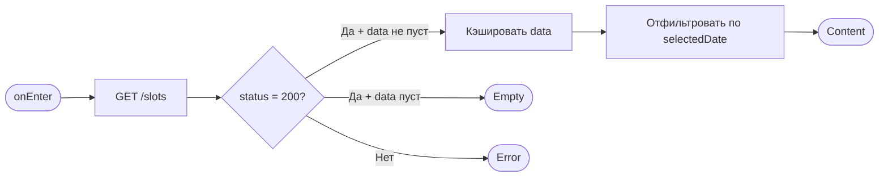
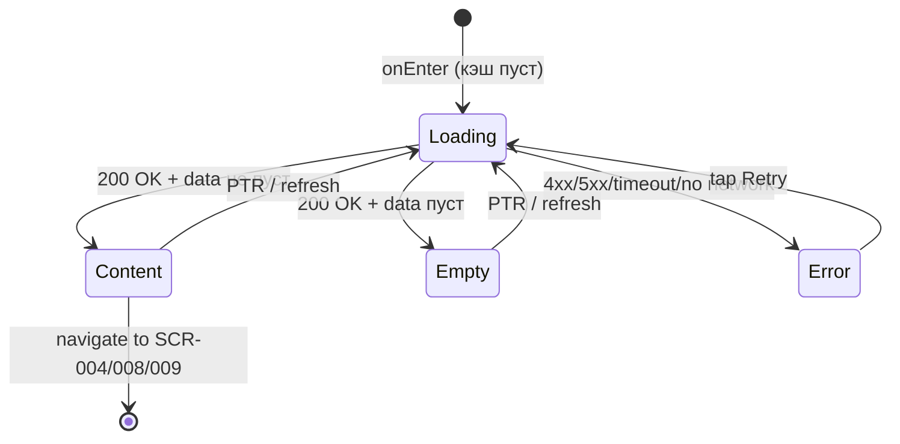

# Расписание

**ID:** SCR-003  
**Тип:** Экран  
**Домен:** 02. Расписание  
**Приоритет:** Critical  
**Статус:** Актуален  
**Функциональные блоки:** FT-03  
**Зона авторизации:** АЗ  
**Дизайн-макет:** —

---

## Содержание

- [История изменений](#история-изменений)
- [Обзор](#обзор)
- [Навигация](#навигация)
- [Входные данные](#входные-данные)
- [Применяемые логики](#применяемые-логики)
- [Инициализация](#инициализация)
- [Используемые запросы](#используемые-запросы)
- [Макет экрана](#макет-экрана)
- [Элементы экрана](#элементы-экрана)
- [Состояния экрана](#состояния-экрана)
- [Действия пользователя](#действия-пользователя)
- [Связанные требования](#связанные-требования)
- [Критерии приёмки](#критерии-приёмки)

---

## История изменений

| Релиз | ТЗ | Описание изменений |
|-------|-----|-------------------|
| 1.0.0 | [ТЗ на мобильное приложение гончарной мастерской](./_INDEX.md) | Первоначальная документация |

---

## Обзор

Экран расписания — главный экран приложения после авторизации. Отображает доступные слоты мастер-классов на 7 дней вперёд. Пользователь выбирает дату в горизонтальном календаре и просматривает список слотов на эту дату. С экрана доступны переходы на детали слота, профиль мастера и программу.

### User Story

> Как авторизованный клиент, я хочу видеть расписание на 7 дней,
> чтобы выбрать удобный слот для записи.

### Бизнес-ценность

- Основная точка входа для записи на мастер-класс — сокращает путь пользователя до целевого действия
- Прозрачное отображение доступности мест снижает количество неудачных попыток бронирования
- Горизонтальный календарь даёт быстрый обзор свободных слотов на неделю без лишних переходов

---

## Навигация

### Входящая

| Источник | Триггер | Условие | Передаваемые параметры |
|----------|---------|---------|------------------------|
| [SCR-001 Вход](./SCR-001_Вход.md) | Успешная аутентификация | Токен действителен | — |
| Tab Bar (иконка "Расписание") | Тап на вкладку | Всегда | — |
| [SCR-005 Мои записи](./SCR-005_Мои_записи.md) | Тап на кнопку "К расписанию" (empty state) | Всегда | — |
| [SCR-004 Детали слота](./SCR-004_Детали_слота.md) | Тап "Назад" | Всегда | — |

### Исходящая

| Назначение | Триггер | Передаваемые параметры |
|------------|---------|------------------------|
| [SCR-004 Детали слота](./SCR-004_Детали_слота.md) | Тап по карточке слота | `slotId` |
| [SCR-008 Профиль мастера](./SCR-008_Профиль_мастера.md) | Тап по имени/аватару мастера | `masterId` |
| [SCR-009 Программа](./SCR-009_Программа.md) | Тап по названию программы | `programId` |

---

## Входные данные

| Название | Тип | Возможные значения | Описание |
|----------|-----|-------------------|----------|
| `selectedDate` | Кэш | `Date` (ISO 8601) | Текущая выбранная дата в календаре. По умолчанию — сегодня |
| `slots` | Кэш | `Slot[]` | Список слотов, полученных при инициализации. Кэшируется для переключения дат без повторного запроса |

---

## Применяемые логики

| Логика | Элемент/Триггер | Описание |
|--------|-----------------|----------|
| [LOGIC-005 Загрузка и фильтрация расписания](../09_Логики/LOGIC-005_Загрузка_и_фильтрация_расписания.md) | Инициализация / Смена даты / Pull-to-refresh | Загрузка слотов на 7 дней, кэширование, фильтрация по дате, обработка состояний загрузки/ошибки |

---

## Инициализация

### Диаграмма загрузки



### Запросы при открытии

| № | Запрос | Критичный | Зависит от | Условие |
|---|--------|-----------|------------|---------|
| 1 | [GET /slots](#get-slots) | Да | — | Всегда (если кэш пуст или устарел) |

> Полное описание запросов см. в секции [Используемые запросы](#используемые-запросы).

---

## Используемые запросы

### GET /slots

**Тип:** REST  
**Метод:** GET  
**Спецификация:** [openapi.yaml](../../api/openapi.yaml) → `getSlots`

**Триггер:** Инициализация, pull-to-refresh

**Параметры:**

| Параметр | Тип | Обязательность | Источник | Описание |
|----------|-----|----------------|----------|----------|
| `dateFrom` | string (date) | Нет | Вычисляется: `selectedDate` | Начало периода (включительно). По умолчанию — сегодня |
| `dateTo` | string (date) | Нет | Вычисляется: `selectedDate + 6 дней` | Конец периода (включительно) |
| `masterId` | integer | Нет | Фильтр (будущая реализация) | Фильтрация по мастеру |
| `programId` | integer | Нет | Фильтр (будущая реализация) | Фильтрация по программе |

**Обработка ответа:**

| Результат | Условие | UI-реакция |
|-----------|---------|------------|
| Загрузка | — | Скелетон-шиммер списка слотов |
| Успех | `data` не пуст | Кэшировать слоты, отфильтровать по `selectedDate`, отобразить список |
| Успех | `data` пуст | Empty state: "Нет слотов на выбранную дату" |
| HTTP 4xx | — | Error state с кнопкой "Повторить" |
| HTTP 5xx | — | Error state с кнопкой "Повторить" |
| Сеть | Нет соединения | Error state с кнопкой "Повторить" |

---

## Макет экрана

### Структура

```
┌─────────────────────────────────────┐
│ StatusBar                           │
├─────────────────────────────────────┤
│ Расписание                          │  ← Header
├─────────────────────────────────────┤
│ Пн   Вт   Ср   Чт   Пт   Сб   Вс   │  ← Calendar (horizontal scroll)
│ 07   08   09   10   11   12   13    │
│      [сегодня]                      │
├─────────────────────────────────────┤
│ ┌─────────────────────────────────┐ │
│ │ Программа: Гончарный круг       │ │  ← Slot Card
│ │ Мастер: Анна Петрова ★ 4.8     │ │
│ │ 10:00 – 12:30                   │ │
│ │ Свободно: 3 / 10   Прокат: +   │ │
│ │ [Записаться]                    │ │
│ └─────────────────────────────────┘ │
│                                     │
│ ┌─────────────────────────────────┐ │
│ │ Программа: Лепка из глины       │ │
│ │ Мастер: Иван Сидоров ★ 4.5     │ │
│ │ 14:00 – 16:30                   │ │
│ │ Свободно: 0 / 6                │ │
│ │ [Нет мест] (disabled)           │ │
│ └─────────────────────────────────┘ │
│                                     │
├─────────────────────────────────────┤
│ [Расписание]  [Мои записи]          │  ← Tab Bar
└─────────────────────────────────────┘
```

### Компоненты

| Компонент | Описание | Обязательность |
|-----------|----------|----------------|
| Header | Заголовок "Расписание" | Да |
| Горизонтальный календарь | 7 дней с подсветкой сегодняшнего и выбранного дня, горизонтальный scroll | Да |
| Список слотов | Вертикальный scroll (FlatList / ScrollView) с карточками слотов на выбранную дату | Да |
| Карточка слота | Отображение информации о слоте: программа, мастер, время, места, прокат, кнопка | Да |
| Pull-to-refresh | Обновление списка слотов жестом сверху вниз | Да |
| Tab Bar | Нижняя навигация: "Расписание" (активен), "Мои записи" | Да |

---

## Элементы экрана

### 1. Горизонтальный календарь

| Элемент | Описание | Источник данных | Валидация | Действие |
|---------|----------|-----------------|-----------|----------|
| Дни недели | Метка дня недели (Пн, Вт, Ср, ...) | Вычисляется от `selectedDate` | — | — |
| Числа | Число месяца для каждого из 7 дней | Вычисляется от сегодняшней даты | — | — |
| Выбранный день | Подсветка выбранной даты (акцентный цвет, фон) | `selectedDate` из кэша | — | — |
| Сегодня | Визуальный индикатор "сегодня" (подчёркивание/кружок) | Сравнение с текущей датой устройства | — | — |

**Логика:**
- При тапе на день → установить `selectedDate` = выбранная дата → отфильтровать кэшированные слоты по дате → обновить список
- `selectedDate` по умолчанию = сегодня

### 2. Список слотов

| Элемент | Описание | Источник данных | Валидация | Действие |
|---------|----------|-----------------|-----------|----------|
| Карточка слота | Контейнер с информацией о слоте | `slot` из кэша (отфильтрованный по `selectedDate`) | — | Тап → [SCR-004](./SCR-004_Детали_слота.md) |
| Название программы | Текст названия программы мастер-класса | `slot.program.name` | — | Тап → [SCR-009](./SCR-009_Программа.md) |
| ФИО мастера | Имя и фамилия мастера + рейтинг (звёзды) | `slot.master.name`, `slot.master.rating` | — | Тап → [SCR-008](./SCR-008_Профиль_мастера.md) |
| Время | Время начала и окончания: `HH:MM – HH:MM` | `slot.dateTime`, `slot.endTime` | — | — |
| Свободные места | Текст вида "Свободно: {available} / {total}" | `slot.availableSpots`, `slot.totalSpots` | — | — |
| Индикатор проката | Иконка или текст "Прокат: +" если `rentalAvailable = true` | `slot.rentalAvailable` | — | — |
| Кнопка "Записаться" | Primary button для перехода к бронированию | — | — | Тап → [SCR-004](./SCR-004_Детали_слота.md) `slotId` |
| Карточка "Нет мест" | Серая неактивная карточка, если `availableSpots = 0` | `slot.availableSpots` | — | — |

**Логика:**
- При смене `selectedDate` (тап по дню в календаре) → применить [LOGIC-005 Загрузка и фильтрация расписания](../09_Логики/LOGIC-005_Загрузка_и_фильтрация_расписания.md) — отфильтровать кэшированные слоты по дате без нового запроса
- Если дата выходит за пределы загруженного 7-дневного диапазона → выполнить новый GET /slots

**Условия доступности:**
- Карточка слота активна (кликабельна), если `availableSpots > 0`
- Карточка слота неактивна (серая, без действий), если `availableSpots = 0`
- Кнопка "Записаться" скрыта, если `availableSpots = 0` (показывать текст "Нет мест")
- Название программы и имя мастера всегда кликабельны (независимо от availableSpots)

---

## Состояния экрана

### Таблица состояний

| Состояние | Условие | Отображение |
|-----------|---------|-------------|
| Loading | Ожидание ответа GET /slots | Скелетон-шиммер: 4-5 прямоугольников-заглушек карточек слотов |
| Content | GET /slots 200 + отфильтрованные слоты есть | Календарь + список карточек слотов |
| Empty | GET /slots 200 + data пуст или на выбранную дату нет слотов | Плашка "Нет слотов на выбранную дату" с иконкой календаря |
| Error | GET /slots 4xx/5xx/таймаут/нет сети | Error state: иконка ошибки, текст "Не удалось загрузить расписание", кнопка "Повторить" |

### Диаграмма переходов



---

## Действия пользователя

| Действие | Элемент | Триггер | Результат |
|----------|---------|---------|-----------|
| Выбрать дату | День в календаре | Tap | Установка `selectedDate`, фильтрация слотов, обновление списка |
| Перейти к деталям слота | Карточка слота | Tap | Переход на [SCR-004](./SCR-004_Детали_слота.md) с `slotId` |
| Перейти к профилю мастера | Имя/аватар мастера | Tap | Переход на [SCR-008](./SCR-008_Профиль_мастера.md) с `masterId` |
| Перейти к программе | Название программы | Tap | Переход на [SCR-009](./SCR-009_Программа.md) с `programId` |
| Обновить расписание | Экран (свайп) | Pull-to-refresh | Повторный GET /slots с теми же параметрами |
| Повторить загрузку | Кнопка "Повторить" (error state) | Tap | Повторный GET /slots |
| Перейти к записям | Вкладка "Мои записи" (Tab Bar) | Tap | Переход на [SCR-005](./SCR-005_Мои_записи.md) |

---

## Связанные требования

### Функциональные (REQ-FUNC-*)

| ID | Название | Приоритет |
|----|----------|-----------|
| FT-03 | Просмотр расписания | Critical |

### Интеграции (REQ-INT-*)

| ID | Название | Приоритет |
|----|----------|-----------|
| REQ-INT-002 | API расписания | Critical |

### UI (REQ-UI-*)

| ID | Название | Приоритет |
|----|----------|-----------|
| REQ-UI-001 | Горизонтальный календарь с подсветкой сегодня | High |
| REQ-UI-002 | Скелетон-загрузка списка слотов | Medium |
| REQ-UI-003 | Pull-to-refresh на списке слотов | Medium |

### Данные (REQ-DATA-*)

| ID | Название | Приоритет |
|----|----------|-----------|
| REQ-DATA-001 | Кэширование слотов для переключения дат без повторного запроса | High |

---

## Критерии приёмки

### Позитивные сценарии

| ID | Критерий | Приоритет |
|----|----------|-----------|
| AC-001 | **Дано** пользователь авторизован, **Когда** открывается экран расписания, **Тогда** выполняется GET /slots с dateFrom=сегодня и dateTo=сегодня+6, при 200 слоты отображаются списком, календарь показывает 7 дней с подсветкой сегодня | P0 |
| AC-002 | **Дано** на выбранную дату нет слотов, **Когда** data пуст, **Тогда** отображается empty state "Нет слотов на выбранную дату" | P0 |
| AC-003 | **Дано** пользователь тапает на другой день в календаре, **Когда** данные за этот день уже в кэше, **Тогда** список фильтруется без нового запроса | P1 |
| AC-004 | **Дано** слот имеет `availableSpots = 0`, **Когда** карточка отображается, **Тогда** она серая, некликабельная, с текстом "Нет мест" | P1 |

### Негативные сценарии

| ID | Критерий | Приоритет |
|----|----------|-----------|
| AC-N01 | **Дано** ошибка сети или сервера, **Когда** выполняется GET /slots, **Тогда** отображается error state с иконкой, текстом "Не удалось загрузить расписание" и кнопкой "Повторить" | P0 |
| AC-N02 | **Дано** 401 при запросе GET /slots, **Когда** токен истёк, **Тогда** выполняется редирект на [SCR-001](./SCR-001_Вход.md) | P1 |

### Граничные условия (Edge Cases)

| ID | Критерий | Приоритет |
|----|----------|-----------|
| AC-E01 | **Дано** полночь, **Когда** пользователь на экране, **Тогда** подсветка "сегодня" должна переключиться на новую дату без перезагрузки экрана | P2 |
| AC-E02 | **Дано** на выбранную дату слоты есть в кэше, но пользователь выбрал дату за пределами 7-дневного окна, **Когда** происходит фильтрация, **Тогда** выполняется новый GET /slots с новым dateFrom/dateTo | P1 |
