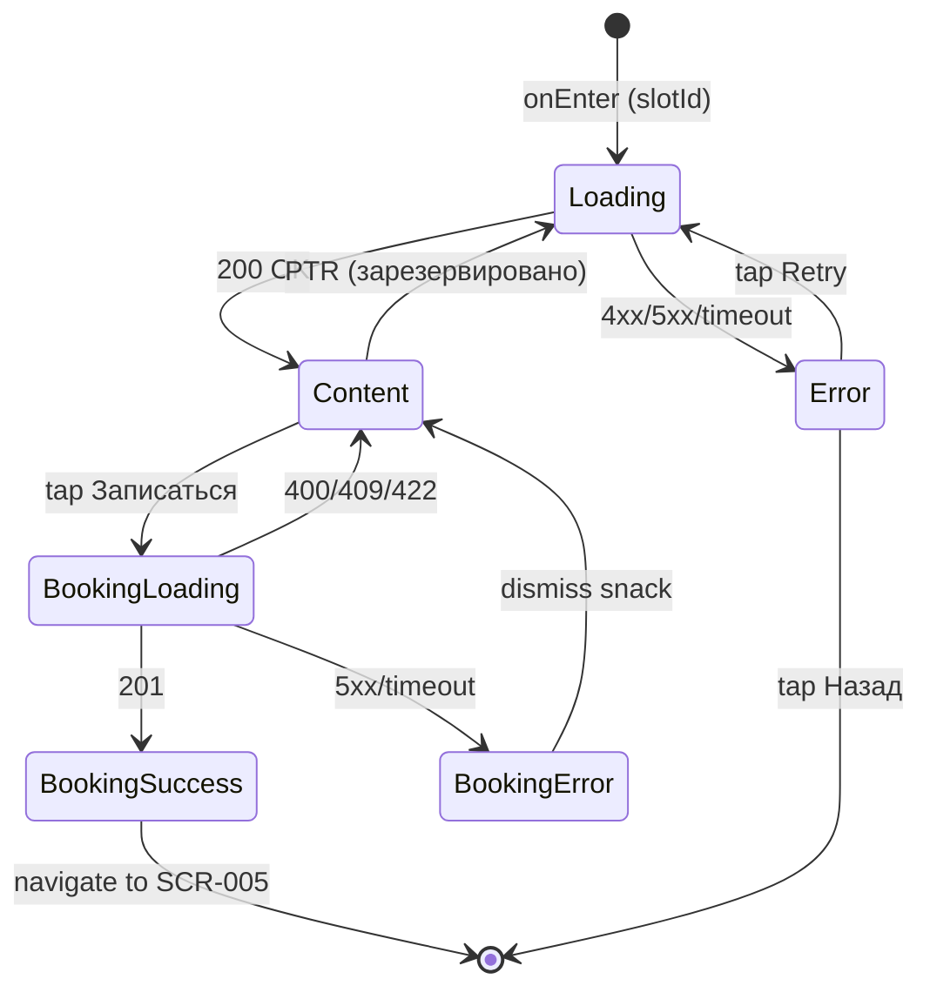

# Детали слота

**ID:** SCR-004  
**Тип:** Экран  
**Домен:** 02. Расписание  
**Приоритет:** Critical  
**Статус:** Актуален  
**Функциональные блоки:** FT-04  
**Зона авторизации:** АЗ  
**Дизайн-макет:** —

---

## Содержание

- [История изменений](#история-изменений)
- [Обзор](#обзор)
- [Навигация](#навигация)
- [Входные данные](#входные-данные)
- [Применяемые логики](#применяемые-логики)
- [Инициализация](#инициализация)
- [Используемые запросы](#используемые-запросы)
- [Макет экрана](#макет-экрана)
- [Элементы экрана](#элементы-экрана)
- [Состояния экрана](#состояния-экрана)
- [Действия пользователя](#действия-пользователя)
- [Связанные требования](#связанные-требования)
- [Критерии приёмки](#критерии-приёмки)

---

## История изменений

| Релиз | ТЗ | Описание изменений |
|-------|-----|-------------------|
| 1.0.0 | [ТЗ на мобильное приложение гончарной мастерской](./_INDEX.md) | Первоначальная документация |

---

## Обзор

Экран детальной информации о выбранном слоте расписания. Отображает название программы, данные мастера, дату и время, описание, количество свободных мест, опцию проката инструментов и кнопку записи. Позволяет записаться на занятие с возможностью аренды инструментов.

### User Story

> Как клиент, я хочу посмотреть детали слота и записаться на занятие, чтобы гарантировать место в группе.

### Бизнес-ценность

- Обеспечивает просмотр полной информации о занятии перед записью
- Реализует основной конверсионный сценарий — бронирование места
- Опция проката инструментов увеличивает средний чек мастерской

---

## Навигация

### Входящая

| Источник | Триггер | Условие | Передаваемые параметры |
|----------|---------|---------|------------------------|
| [SCR-003 Расписание](./SCR-003_Расписание.md) | Тап по слоту | Всегда | `slotId` |
| Push-уведомление | Тап на уведомление | `type = reminder` | `slotId` |

### Исходящая

| Назначение | Триггер | Передаваемые параметры |
|------------|---------|------------------------|
| [SCR-005 Мои записи](./SCR-005_Мои_записи.md) | Успешное бронирование (201) | — |
| [SCR-008 Профиль мастера](./SCR-008_Профиль_мастера.md) | Тап по блоку мастера | `masterId` |
| [SCR-009 Программа](./SCR-009_Программа.md) | Тап по названию программы | `programId` |

---

## Входные данные

| Название | Тип | Возможные значения | Описание |
|----------|-----|-------------------|----------|
| `slotId` | Состояние | ID слота (integer) | Идентификатор слота, переданный с экрана расписания или из push-уведомления |

---

## Применяемые логики

| Логика | Элемент/Триггер | Описание |
|--------|-----------------|----------|
| [LOGIC-004 Бронирование с прокатом](../09_Логики/LOGIC-004_Бронирование_с_прокатом.md) | Кнопка "Записаться" | Проверка авторизации, доступности мест, отправка POST /bookings, обработка ошибок, переход на SCR-005 |
| [LOGIC-005 Загрузка и фильтрация расписания](../09_Логики/LOGIC-005_Загрузка_и_фильтрация_расписания.md) | Инициализация экрана | Загрузка деталей слота через GET /slots/{slotId} |

---

## Инициализация

### Диаграмма загрузки

```mermaid
flowchart LR
    Start([onEnter: slotId]) --> GetSlot[GET /slots/{slotId}]
    GetSlot -->|200 + data| Ready([Content])
    GetSlot -->|404| NotFound([Error: Слот не найден])
    GetSlot -->|4xx/5xx/timeout| Error([Error: Ошибка загрузки])
```

### Запросы при открытии

| № | Запрос | Критичный | Зависит от | Условие |
|---|--------|-----------|------------|---------|
| 1 | [GET /slots/{slotId}](#get-slotslotid) | Да | — | `slotId` передан |

---

## Используемые запросы

### GET /slots/{slotId}

**Тип:** REST  
**Метод:** GET  
**Спецификация:** [openapi.yaml](../../api/openapi.yaml) → `getSlotById`

**Триггер:** Инициализация экрана

**Параметры:**

| Параметр | Тип | Обязательность | Источник | Описание |
|----------|-----|----------------|----------|----------|
| `slotId` | integer | Да | Параметр навигации `slotId` | ID выбранного слота |

**Обработка ответа:**

| Результат | Условие | UI-реакция |
|-----------|---------|------------|
| Загрузка | — | Скелетон-шиммер основных блоков |
| Успех | 200 + `data` не пуст | Отобразить детали слота: программу, мастера, дату/время, описание, места, прокат |
| Успех | 200 + `data.availableSpots = 0` | Отобразить детали, но кнопка "Записаться" неактивна, текст "Нет мест" |
| Успех | 200 + клиент уже записан | Отобразить детали + индикатор "Вы записаны", кнопка скрыта |
| HTTP 4xx | 404 | Error state: "Слот не найден" с кнопкой "Назад" |
| HTTP 4xx | 401 | Редирект на экран входа |
| HTTP 4xx | Иной 4xx | Error state с кнопкой "Обновить" |
| HTTP 5xx | — | Error state с кнопкой "Обновить" |
| Сеть | Нет соединения | Error state с кнопкой "Обновить" |

---

### POST /bookings

**Тип:** REST  
**Метод:** POST  
**Спецификация:** [openapi.yaml](../../api/openapi.yaml) → `createBooking`

**Триггер:** Тап на кнопку "Записаться"

**Параметры:**

| Параметр | Тип | Обязательность | Источник | Описание |
|----------|-----|----------------|----------|----------|
| `slotId` | integer | Да | Из данных слота | ID слота, на который записывается клиент |
| `rentalSelected` | bool | Нет (default: false) | Переключатель "Арендовать инструменты" | Флаг необходимости проката инструментов |

**Обработка ответа:**

| Результат | Условие | UI-реакция |
|-----------|---------|------------|
| Загрузка | — | Лоадер на кнопке "Записаться", блокировка UI |
| Успех | 201 | Снек "Вы записаны!", обновить кэш броней, переход на [SCR-005](./SCR-005_Мои_записи.md) |
| HTTP 4xx | 400 | Снек с текстом ошибки из `message` |
| HTTP 4xx | 401 | Снек "Неавторизованный доступ. Выполните вход" |
| HTTP 4xx | 409 | Снек "Вы уже записаны на этот слот" |
| HTTP 5xx | — | Снек "Произошла ошибка. Попробуйте позже" |
| Сеть | Нет соединения | Снек "Нет соединения. Проверьте подключение" |

---

## Макет экрана

### Структура

```
┌─────────────────────────────────────┐
│ [←] Детали занятия                  │  ← Header
├─────────────────────────────────────┤
│                                     │
│  ┌─────────────────────────────────┐│
│  │ Название программы          [>] ││  ← Блок программы (тап → SCR-009)
│  └─────────────────────────────────┘│
│                                     │
│  ┌─────────────────────────────────┐│
│  │ [Фото] Имя мастера         [>] ││  ← Блок мастера (тап → SCR-008)
│  └─────────────────────────────────┘│
│                                     │
│  📅 15 июня 2025                    │
│  🕐 10:00 – 11:30                   │
│                                     │
│  📝 Описание программы              │
│  Текст описания...                  │
│                                     │
│  👥 5 свободных из 10 мест          │
│                                     │
│  ─────────────────────────────────  │
│                                     │
│  [🛠] Арендовать инструменты: OFF   │
│       Стоимость проката: 500 ₽      │
│                                     │
│         [ Записаться ]              │
│                                     │
└─────────────────────────────────────┘
```

### Компоненты

| Компонент | Описание | Обязательность |
|-----------|----------|----------------|
| Header | Кнопка "Назад" + заголовок "Детали занятия" | Да |
| Блок программы | Название программы (тап → SCR-009) | Да |
| Блок мастера | Фото (аватар) + имя мастера (тап → SCR-008) | Да |
| Блок даты и времени | Дата, время начала и окончания | Да |
| Блок описания | Текстовое описание программы | Да |
| Блок мест | "N свободных из M мест" или "Нет мест" | Да |
| Переключатель проката | Переключатель "Арендовать инструменты" + цена проката | Да (если `rentalAvailable = true`) |
| Кнопка "Записаться" | Primary button для бронирования | Да |
| Индикатор "Вы записаны" | Текст, заменяющий кнопку при уже созданной броне | Опционально |

---

## Элементы экрана

### 1. Верхняя панель (Header)

| Элемент | Описание | Источник данных | Валидация | Действие |
|---------|----------|-----------------|-----------|----------|
| Кнопка "Назад" | Иконка стрелки влево | — | — | Возврат на [SCR-003 Расписание](./SCR-003_Расписание.md) |
| Заголовок "Детали занятия" | Текст в центре header | — | — | — |

---

### 2. Информационные блоки

| Элемент | Описание | Источник данных | Валидация | Действие |
|---------|----------|-----------------|-----------|----------|
| Название программы | Крупный текст, жирный | `slot.program.name` из GET /slots/{slotId} | — | Переход на [SCR-009 Программа](./SCR-009_Программа.md) |
| Фото мастера | Аватар мастера (круглая иконка) | `slot.master.photo` из GET /slots/{slotId} | — | Переход на [SCR-008 Профиль мастера](./SCR-008_Профиль_мастера.md) |
| Имя мастера | Текст с именем мастера | `slot.master.name` из GET /slots/{slotId} | — | Переход на [SCR-008 Профиль мастера](./SCR-008_Профиль_мастера.md) |
| Дата | Дата проведения занятия | `slot.dateTime` из GET /slots/{slotId} | — | — |
| Время начала | ЧЧ:ММ начала | `slot.dateTime` из GET /slots/{slotId} | — | — |
| Время окончания | ЧЧ:ММ окончания | `slot.endTime` из GET /slots/{slotId} | — | — |
| Описание программы | Текстовое описание | `slot.program.description` из GET /slots/{slotId} | — | — |
| Счётчик мест | "N свободных из M мест" или "Нет мест" | `slot.availableSpots`, `slot.totalSpots` из GET /slots/{slotId} | — | — |

**Логика:**
- Счётчик мест: если `availableSpots = 0`, отображается "Нет мест" (красным цветом); иначе "N свободных из M мест" (зелёным при N > 0).

---

### 3. Блок проката инструментов

| Элемент | Описание | Источник данных | Валидация | Действие |
|---------|----------|-----------------|-----------|----------|
| Переключатель "Арендовать инструменты" | Switch / Toggle | `slot.rentalAvailable` из GET /slots/{slotId} | — | Переключение `rentalSelected: true/false` |
| Стоимость проката | Текст с ценой | `slot.rentalPrice` из GET /slots/{slotId} | — | — |

**Условия доступности:**
- Блок проката отображается, только если `slot.rentalAvailable = true`
- Если `rentalAvailable = false`, блок скрыт полностью

---

### 4. Кнопка действия

| Элемент | Описание | Источник данных | Валидация | Действие |
|---------|----------|-----------------|-----------|----------|
| Кнопка "Записаться" | Primary button, full-width | — | — | [POST /bookings](#post-bookings) |
| Индикатор "Вы записаны" | Текст вместо кнопки | Проверка наличия брони у клиента | — | — |

**Условия доступности:**
- Если `slot.availableSpots > 0` И клиент не записан → кнопка активна, текст "Записаться"
- Если `slot.availableSpots = 0` → кнопка неактивна (disabled), текст "Нет мест"
- Если клиент уже записан → кнопка скрыта, отображается текст "✓ Вы записаны" с зелёной иконкой
- Если слот прошедший (дата/время < now) → кнопка неактивна (disabled), текст "Занятие прошло"

**Логика:**
- Кнопка "Записаться": [LOGIC-004 Бронирование с прокатом](../09_Логики/LOGIC-004_Бронирование_с_прокатом.md) — при тапе проверяется авторизация, если не авторизован — редирект на SCR-001; иначе отправляется POST /bookings с параметрами `slotId` и `rentalSelected`

---

## Состояния экрана

### Таблица состояний

| Состояние | Условие | Отображение |
|-----------|---------|-------------|
| Loading | Ожидание ответа GET /slots/{slotId} | Скелетон-шиммер: блок программы, мастера, даты, описания |
| Content | 200 + данные слота получены | Стандартный контент |
| Error | 4xx/5xx/timeout при GET /slots/{slotId} | Error state с иконкой, текстом "Не удалось загрузить данные" и кнопкой "Повторить" |
| BookingLoading | Ожидание ответа POST /bookings | Лоадер на кнопке "Записаться", блокировка UI |
| BookingSuccess | 201 от POST /bookings | Снек "Вы записаны!", переход на [SCR-005](./SCR-005_Мои_записи.md) |
| BookingError | 4xx/5xx/timeout при POST /bookings | Снек с текстом ошибки, кнопка разблокирована |

### Диаграмма переходов



---

## Действия пользователя

| Действие | Элемент | Триггер | Результат |
|----------|---------|---------|-----------|
| Вернуться к расписанию | Кнопка "Назад" | Tap | Переход на [SCR-003 Расписание](./SCR-003_Расписание.md) |
| Просмотреть программу | Название программы | Tap | Переход на [SCR-009 Программа](./SCR-009_Программа.md) |
| Просмотреть профиль мастера | Блок мастера (фото/имя) | Tap | Переход на [SCR-008 Профиль мастера](./SCR-008_Профиль_мастера.md) |
| Выбрать прокат инструментов | Переключатель "Арендовать инструменты" | Tap | Переключение состояния `rentalSelected` (true/false) |
| Записаться на слот | Кнопка "Записаться" | Tap | [LOGIC-004](../09_Логики/LOGIC-004_Бронирование_с_прокатом.md) → POST /bookings |
| Повторить загрузку | Кнопка "Повторить" (error state) | Tap | Повторный GET /slots/{slotId} |

---

## Связанные требования

### Функциональные (REQ-FUNC-*)

| ID | Название | Приоритет |
|----|----------|-----------|
| FT-04 | Бронирование слота | Critical |

---

## Критерии приёмки

### Позитивные сценарии

| ID | Критерий | Приоритет |
|----|----------|-----------|
| AC-001 | **Дано** передан `slotId`, **Когда** экран открывается, **Тогда** выполняется GET /slots/{slotId}, отображаются все детали слота: программа, мастер, дата/время, описание, места, прокат | P0 |
| AC-002 | **Дано** слот доступен (availableSpots > 0) и клиент авторизован, **Когда** пользователь нажимает "Записаться", **Тогда** выполняется POST /bookings, при 201 — снек "Вы записаны!" и переход на [SCR-005](./SCR-005_Мои_записи.md) | P0 |
| AC-003 | **Дано** availableSpots = 0, **Когда** экран загружен, **Тогда** кнопка "Записаться" неактивна, текст "Нет мест" | P0 |

### Негативные сценарии

| ID | Критерий | Приоритет |
|----|----------|-----------|
| AC-N01 | **Дано** POST /bookings возвращает 409, **Когда** пользователь нажимает "Записаться", **Тогда** отображается снек "Вы уже записаны на этот слот" | P0 |
| AC-N02 | **Дано** GET /slots/{slotId} возвращает 401, **Когда** экран открывается, **Тогда** выполняется редирект на экран входа | P0 |
| AC-N03 | **Дано** GET /slots/{slotId} возвращает 404, **Когда** экран открывается, **Тогда** отображается error state "Слот не найден" | P0 |
| AC-N04 | **Дано** POST /bookings возвращает 400, **Когда** пользователь нажимает "Записаться", **Тогда** отображается снек с текстом ошибки из ответа | P1 |
| AC-N05 | **Дано** слот прошедший (дата/время < now), **Когда** экран загружен, **Тогда** кнопка "Записаться" неактивна, текст "Занятие прошло" | P1 |
| AC-N06 | **Дано** ошибка сети при GET /slots/{slotId}, **Когда** экран открывается, **Тогда** отображается error state с кнопкой "Повторить" | P1 |

### Граничные условия (Edge Cases)

| ID | Критерий | Приоритет |
|----|----------|-----------|
| AC-E01 | **Дано** клиент уже записан на слот, **Когда** экран загружен, **Тогда** кнопка "Записаться" скрыта, отображается "✓ Вы записаны" | P0 |
| AC-E02 | **Дано** слот имеет rentalAvailable = false, **Когда** экран загружен, **Тогда** блок проката инструментов скрыт | P1 |
| AC-E03 | **Дано** пользователь не авторизован, **Когда** нажимает "Записаться", **Тогда** выполняется редирект на [SCR-001 Вход](./SCR-001_Вход.md) | P1 |

---
