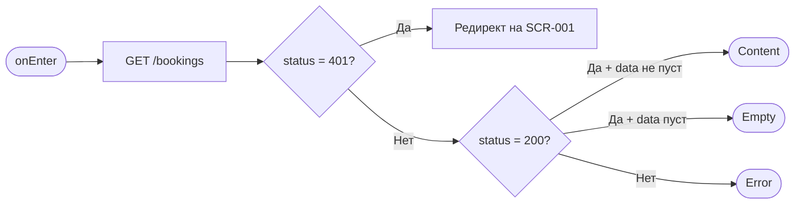
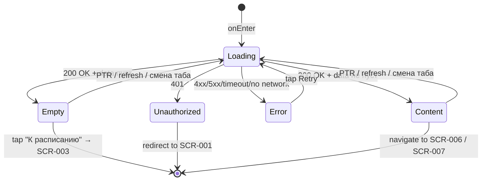

# Мои записи

**ID:** SCR-005  
**Тип:** Экран  
**Домен:** 03. Брони  
**Приоритет:** High  
**Статус:** Актуален  
**Функциональные блоки:** FT-05  
**Зона авторизации:** АЗ  
**Дизайн-макет:** —

---

## Содержание

- [История изменений](#история-изменений)
- [Обзор](#обзор)
- [Навигация](#навигация)
- [Входные данные](#входные-данные)
- [Применяемые логики](#применяемые-логики)
- [Инициализация](#инициализация)
- [Используемые запросы](#используемые-запросы)
- [Макет экрана](#макет-экрана)
- [Элементы экрана](#элементы-экрана)
- [Состояния экрана](#состояния-экрана)
- [Действия пользователя](#действия-пользователя)
- [Связанные требования](#связанные-требования)
- [Критерии приёмки](#критерии-приёмки)

---

## История изменений

| Релиз | ТЗ | Описание изменений |
|-------|-----|-------------------|
| 1.0.0 | [ТЗ на мобильное приложение гончарной мастерской](./_INDEX.md) | Первоначальная документация |

---

## Обзор

Экран "Мои записи" отображает список всех броней текущего клиента. Доступна фильтрация по статусам через табы: активные, прошедшие, отменённые. Для прошедших неоценённых броней отображается кнопка "Оценить мастера". Пустое состояние содержит предложение перейти к расписанию.

### User Story

> Как клиент, я хочу видеть мои записи,
> чтобы отслеживать статусы броней и оценивать мастера после посещения.

### Бизнес-ценность

- Даёт пользователю прозрачность по всем его броням в одном месте
- Сокращает отток: пользователь видит статусы и может вовремя отменить или перенести запись
- Стимулирует оставлять обратную связь через кнопку "Оценить мастера"

---

## Навигация

### Входящая

| Источник | Триггер | Условие | Передаваемые параметры |
|----------|---------|---------|------------------------|
| Tab Bar (иконка "Мои записи") | Тап на вкладку | Всегда | — |
| [SCR-004 Детали слота](./SCR-004_Детали_слота.md) | Успешное создание брони | Слот забронирован | — |
| [SCR-006 Детали брони](./SCR-006_Детали_брони.md) | Тап "Назад" / успешная отмена | Всегда | — |
| [SCR-007 Оценка мастера](./SCR-007_Оценка_мастера.md) | Успешная отправка оценки | Всегда | — |

### Исходящая

| Назначение | Триггер | Передаваемые параметры |
|------------|---------|------------------------|
| [SCR-006 Детали брони](./SCR-006_Детали_брони.md) | Тап по карточке брони | `bookingId` |
| [SCR-007 Оценка мастера](./SCR-007_Оценка_мастера.md) | Тап на кнопку "Оценить мастера" | `bookingId`, `masterId`, `slotId` |
| [SCR-003 Расписание](./SCR-003_Расписание.md) | Тап на кнопку "К расписанию" (empty state) | — |

---

## Входные данные

| Название | Тип | Возможные значения | Описание |
|----------|-----|-------------------|----------|
| — | — | — | Экран не принимает входные параметры. Данные загружаются с API при инициализации. |

---

## Применяемые логики

> *Секция опциональна. Указывать, если на экране используется переиспользуемая бизнес-логика из раздела [09_Логики](09_Логики/_INDEX.md).*

На экране не используются переиспользуемые бизнес-логики. Вся логика фильтрации по табам и отображения уникальна для экрана SCR-005.

---

## Инициализация

### Диаграмма загрузки



### Запросы при открытии

| № | Запрос | Критичный | Зависит от | Условие |
|---|--------|-----------|------------|---------|
| 1 | [GET /bookings](#get-bookings) | Да | — | Всегда |

> Полное описание запросов см. в секции [Используемые запросы](#используемые-запросы).

---

## Используемые запросы

### GET /bookings

**Тип:** REST  
**Метод:** GET  
**Спецификация:** [openapi.yaml](../../api/openapi.yaml) → `getMyBookings`

**Триггер:** Инициализация, смена таба, pull-to-refresh

**Параметры:**

| Параметр | Тип | Обязательность | Источник | Описание |
|----------|-----|----------------|----------|----------|
| `status` | string | Нет | Выбранный таб | Фильтр по статусу. Если таб "Отменённые", клиент выполняет два запроса: `status=отменена клиентом` и `status=отменена мастерской`, результаты объединяются. Для "Прошедших" и "Активных" — без параметра (фильтрация на клиенте, см. логику ниже) |

**Обработка ответа:**

| Результат | Условие | UI-реакция |
|-----------|---------|------------|
| Загрузка | — | Скелетон-шиммер списка карточек броней |
| Успех | `data` не пуст | Отобразить список карточек броней с фильтрацией по выбранному табу |
| Успех | `data` пуст | Empty state: плашка "У вас нет записей" с кнопкой "К расписанию" |
| HTTP 401 | — | Редирект на [SCR-001 Вход](./SCR-001_Вход.md) |
| HTTP 4xx (кроме 401) | — | Error state с кнопкой "Повторить" |
| HTTP 5xx | — | Error state с кнопкой "Повторить" |
| Сеть | Нет соединения | Error state с кнопкой "Повторить" |

---

## Макет экрана

### Структура

```
┌─────────────────────────────────────┐
│ StatusBar                           │
├─────────────────────────────────────┤
│ Мои записи                          │  ← Header
├─────────────────────────────────────┤
│ [Активные] [Прошедшие] [Отменённые] │  ← Tabs (Scrollable)
├─────────────────────────────────────┤
│ ┌─────────────────────────────────┐ │
│ │ Гончарный круг                  │ │  ← Booking Card
│ │ 15.07.2026, 10:00 – 12:30      │ │
│ │ Мастер: Анна Петрова            │ │
│ │ ● Активна                       │ │  ← Status indicator (green)
│ └─────────────────────────────────┘ │
│                                     │
│ ┌─────────────────────────────────┐ │
│ │ Лепка из глины                  │ │
│ │ 10.07.2026, 14:00 – 16:30      │ │
│ │ Мастер: Иван Сидоров            │ │
│ │ ○ Завершено                     │ │  ← Status indicator (grey)
│ │ [Оценить мастера]               │ │  ← Rate button (visible if unrated)
│ └─────────────────────────────────┘ │
│                                     │
├─────────────────────────────────────┤
│ [Расписание]  [Мои записи]          │  ← Tab Bar
└─────────────────────────────────────┘
```

### Компоненты

| Компонент | Описание | Обязательность |
|-----------|----------|----------------|
| Header | Заголовок "Мои записи" | Да |
| Табы | Горизонтальные табы: Активные, Прошедшие, Отменённые | Да |
| Список броней | Вертикальный scroll (FlatList / ScrollView) с карточками броней | Да |
| Карточка брони | Отображение информации о брони: программа, дата/время, мастер, статус | Да |
| Кнопка "Оценить мастера" | Вторичная кнопка на карточке прошедшей неоценённой брони | Условно |
| Pull-to-refresh | Обновление списка броней жестом сверху вниз | Да |
| Tab Bar | Нижняя навигация: "Расписание", "Мои записи" (активен) | Да |

---

## Элементы экрана

### 1. Табы фильтрации

| Элемент | Описание | Источник данных | Валидация | Действие |
|---------|----------|-----------------|-----------|----------|
| Таб "Активные" | Фильтр: `status = активна` И `endTime > now` | Вычисляется на клиенте | — | Тап → GET /bookings (без status) → клиентская фильтрация |
| Таб "Прошедшие" | Фильтр: `status = активна` И `endTime < now` | Вычисляется на клиенте | — | Тап → GET /bookings (без status) → клиентская фильтрация |
| Таб "Отменённые" | Фильтр: `status IN (отменена клиентом, отменена мастерской)` | Два ответа API | — | Тап → GET /bookings?status=отменена клиентом + GET /bookings?status=отменена мастерской → объединение |

**Логика:**
- Выбранный таб подсвечивается акцентным цветом, неактивные — нейтральным
- При инициализации и pull-to-refresh выполняется GET /bookings (без status) — возвращаются все брони
- **Табы «Активные»/«Прошедшие»**: фильтрация выполняется на клиенте:
  - Активные: `booking.slot.endTime >= now` И `status = "активна"`
  - Прошедшие: `booking.slot.endTime < now` И `status = "активна"`
- **Таб «Отменённые»**: выполняются два параллельных запроса с `status=отменена клиентом` и `status=отменена мастерской`, результаты объединяются в один список
- Смена таба не выполняет новый запрос к API (кроме таба «Отменённые» при первом переключении на него) — данные уже загружены, применяется клиентская фильтрация

### 2. Список броней

| Элемент | Описание | Источник данных | Валидация | Действие |
|---------|----------|-----------------|-----------|----------|
| Карточка брони | Контейнер с информацией о брони | `booking` из ответа API | — | Тап → [SCR-006](./SCR-006_Детали_брони.md) |
| Название программы | Текст названия программы | `booking.slot.program.name` | — | — |
| Дата и время | Строка вида "15.07.2026, 10:00 – 12:30" | `booking.slot.dateTime`, `booking.slot.endTime` | — | — |
| Имя мастера | ФИО мастера | `booking.slot.master.name` | — | — |
| Индикатор статуса | Цветной кружок/текст статуса | `booking.status` | — | — |
| Кнопка "Оценить мастера" | Secondary button | — | — | Тап → [SCR-007](./SCR-007_Оценка_мастера.md) |

**Логика:**
- Индикатор статуса: `активна` → зелёный, `отменена клиентом` → красный, `отменена мастерской` → оранжевый
- Кнопка "Оценить мастера" видна только для броней с фактическим статусом "прошедшая" (слот завершился, статус был `активна`, оценка ещё не оставлена)
- Фильтр прошедших: брони, у которых `slot.endTime` < текущее время И `status = активна` И нет оценки от текущего клиента

**Условия доступности:**
- Кнопка "Оценить мастера" видна, если: бронь прошедшая (`slot.endTime` в прошлом) И не оценена
- Карточка брони всегда кликабельна (переход на [SCR-006](./SCR-006_Детали_брони.md))

---

## Состояния экрана

### Таблица состояний

| Состояние | Условие | Отображение |
|-----------|---------|-------------|
| Loading | Ожидание ответа GET /bookings | Скелетон-шиммер: 3-4 прямоугольника-заглушки карточек броней |
| Content | GET /bookings 200 + data не пуст | Табы + список карточек броней |
| Empty | GET /bookings 200 + data пуст | Плашка "У вас нет записей" с иконкой, кнопка "К расписанию" |
| Error | GET /bookings 4xx/5xx/таймаут/нет сети | Error state: иконка, текст "Не удалось загрузить записи", кнопка "Повторить" |
| Unauthorized | GET /bookings 401 | Редирект на [SCR-001 Вход](./SCR-001_Вход.md) |

### Диаграмма переходов



---

## Действия пользователя

| Действие | Элемент | Триггер | Результат |
|----------|---------|---------|-----------|
| Выбрать таб | Таб "Активные" / "Прошедшие" / "Отменённые" | Tap | Установка активного таба, GET /bookings с соответствующим `status`, обновление списка |
| Перейти к деталям брони | Карточка брони | Tap | Переход на [SCR-006](./SCR-006_Детали_брони.md) с `bookingId` |
| Оценить мастера | Кнопка "Оценить мастера" | Tap | Переход на [SCR-007](./SCR-007_Оценка_мастера.md) с `bookingId`, `masterId`, `slotId` |
| Обновить список | Экран (свайп) | Pull-to-refresh | Повторный GET /bookings с параметрами текущего таба |
| Повторить загрузку | Кнопка "Повторить" (error state) | Tap | Повторный GET /bookings |
| Перейти к расписанию | Кнопка "К расписанию" (empty state) | Tap | Переход на [SCR-003](./SCR-003_Расписание.md) |
| Перейти к расписанию | Вкладка "Расписание" (Tab Bar) | Tap | Переход на [SCR-003](./SCR-003_Расписание.md) |

---

## Связанные требования

### Функциональные (REQ-FUNC-*)

| ID | Название | Приоритет |
|----|----------|-----------|
| FT-05 | Просмотр списка броней | High |

### Интеграции (REQ-INT-*)

| ID | Название | Приоритет |
|----|----------|-----------|
| REQ-INT-003 | API броней | High |

### UI (REQ-UI-*)

| ID | Название | Приоритет |
|----|----------|-----------|
| REQ-UI-004 | Табы с фильтрацией по статусам | High |
| REQ-UI-005 | Цветовые индикаторы статуса брони | Medium |

### Данные (REQ-DATA-*)

| ID | Название | Приоритет |
|----|----------|-----------|
| REQ-DATA-002 | Фильтрация броней на стороне API по параметру `status` | High |

---

## Критерии приёмки

### Позитивные сценарии

| ID | Критерий | Приоритет |
|----|----------|-----------|
| AC-001 | **Дано** у клиента есть брони, **Когда** открывается экран "Мои записи", **Тогда** выполняется GET /bookings, при 200 отображается список карточек с программой, датой/временем, мастером и индикатором статуса | P0 |
| AC-002 | **Дано** выбран таб "Активные", **Когда** пользователь тапает "Прошедшие", **Тогда** выполняется GET /bookings без параметра status, список обновляется | P0 |
| AC-003 | **Дано** у клиента нет броней, **Когда** GET /bookings возвращает пустой массив, **Тогда** отображается empty state "У вас нет записей" с кнопкой "К расписанию" | P1 |
| AC-004 | **Дано** прошедшая бронь не оценена, **Когда** карточка брони отображается, **Тогда** на ней присутствует кнопка "Оценить мастера" | P1 |

### Негативные сценарии

| ID | Критерий | Приоритет |
|----|----------|-----------|
| AC-N01 | **Дано** ошибка сети или сервера, **Когда** выполняется GET /bookings, **Тогда** отображается error state с кнопкой "Повторить" | P0 |
| AC-N02 | **Дано** токен истёк, **Когда** GET /bookings возвращает 401, **Тогда** выполняется редирект на [SCR-001](./SCR-001_Вход.md) | P0 |

### Граничные условия (Edge Cases)

| ID | Критерий | Приоритет |
|----|----------|-----------|
| AC-E01 | **Дано** бронь была создана, но слот ещё не начался, **Когда** отображается таб "Активные", **Тогда** броня показывается со статусом "Активна" и зелёным индикатором | P1 |
| AC-E02 | **Дано** слот закончился менее часа назад, **Когда** отображается таб "Прошедшие", **Тогда** броня показывается в прошедших с кнопкой "Оценить мастера" (если ещё не оценена) | P1 |
