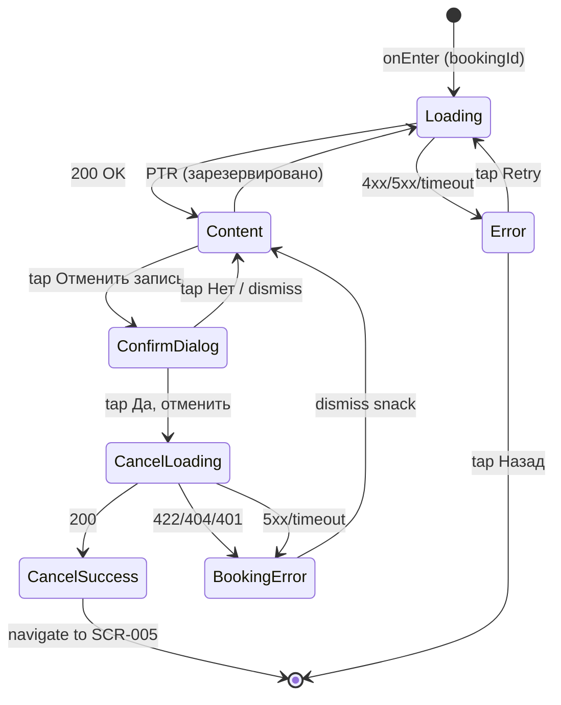

# Детали брони

**ID:** SCR-006  
**Тип:** Экран  
**Домен:** 03. Брони  
**Приоритет:** High  
**Статус:** Актуален  
**Функциональные блоки:** FT-06  
**Зона авторизации:** АЗ  
**Дизайн-макет:** —

---

## Содержание

- [История изменений](#история-изменений)
- [Обзор](#обзор)
- [Навигация](#навигация)
- [Входные данные](#входные-данные)
- [Применяемые логики](#применяемые-логики)
- [Инициализация](#инициализация)
- [Используемые запросы](#используемые-запросы)
- [Макет экрана](#макет-экрана)
- [Элементы экрана](#элементы-экрана)
- [Состояния экрана](#состояния-экрана)
- [Действия пользователя](#действия-пользователя)
- [Связанные требования](#связанные-требования)
- [Критерии приёмки](#критерии-приёмки)

---

## История изменений

| Релиз | ТЗ | Описание изменений |
|-------|-----|-------------------|
| 1.0.0 | [ТЗ на мобильное приложение гончарной мастерской](./_INDEX.md) | Первоначальная документация |

---

## Обзор

Экран детальной информации о брони клиента. Отображает данные о занятии, статус брони, отметку о прокате и блок доступных действий. Позволяет отменить активную бронь при соблюдении временных ограничений (≥ 4 часов до начала).

### User Story

> Как клиент, я хочу посмотреть детали брони и отменить её, если планы изменились.

### Бизнес-ценность

- Предоставляет клиенту полную информацию о его записи
- Реализует механизм отмены, освобождающий слоты для других клиентов
- Предотвращает отмены в последний момент, защищая расписание мастерской

---

## Навигация

### Входящая

| Источник | Триггер | Условие | Передаваемые параметры |
|----------|---------|---------|------------------------|
| [SCR-005 Мои записи](./SCR-005_Мои_записи.md) | Тап по брони | Всегда | `bookingId` |
| Push-уведомление | Тап на уведомление | `type = cancellation` | `bookingId` |

### Исходящая

| Назначение | Триггер | Передаваемые параметры |
|------------|---------|------------------------|
| [SCR-005 Мои записи](./SCR-005_Мои_записи.md) | Успешная отмена брони | — |
| [SCR-008 Профиль мастера](./SCR-008_Профиль_мастера.md) | Тап по имени мастера | `masterId` |

---

## Входные данные

| Название | Тип | Возможные значения | Описание |
|----------|-----|-------------------|----------|
| `bookingId` | Состояние | UUID брони | Идентификатор брони, переданный со списка броней или из push-уведомления |

---

## Применяемые логики

| Логика | Элемент/Триггер | Описание |
|--------|-----------------|----------|
| [LOGIC-002 Отмена брони](../09_Логики/LOGIC-002_Отмена_брони.md) | Кнопка "Отменить запись" | Проверка времени до начала (≥ 4ч), диалог подтверждения, отправка PATCH /bookings/{bookingId}/cancel, обработка ошибок |

---

## Инициализация

### Диаграмма загрузки

```mermaid
flowchart LR
    Start([onEnter: bookingId]) --> GetBooking[GET /bookings/{bookingId}]
    GetBooking -->|200 + data| Ready([Content])
    GetBooking -->|404| NotFound([Error: Бронь не найдена])
    GetBooking -->|4xx/5xx/timeout| Error([Error: Ошибка загрузки])
```

### Запросы при открытии

| № | Запрос | Критичный | Зависит от | Условие |
|---|--------|-----------|------------|---------|
| 1 | [GET /bookings/{bookingId}](#get-bookingsbookingid) | Да | — | `bookingId` передан |

---

## Используемые запросы

### GET /bookings/{bookingId}

**Тип:** REST  
**Метод:** GET  
**Спецификация:** [openapi.yaml](../../api/openapi.yaml) → `getBookingById`

**Триггер:** Инициализация экрана

**Параметры:**

| Параметр | Тип | Обязательность | Источник | Описание |
|----------|-----|----------------|----------|----------|
| `bookingId` | string | Да | Параметр навигации `bookingId` | UUID брони |

**Обработка ответа:**

| Результат | Условие | UI-реакция |
|-----------|---------|------------|
| Загрузка | — | Скелетон-шиммер основных блоков |
| Успех | 200 + `data` не пуст | Отобразить детали брони: программу, дату/время, мастера, статус, прокат, блок действий в зависимости от статуса и времени |
| HTTP 4xx | 404 | Error state: "Бронь не найдена" с кнопкой "Назад" |
| HTTP 4xx | 401 | Редирект на экран входа |
| HTTP 4xx | Иной 4xx | Error state с кнопкой "Обновить" |
| HTTP 5xx | — | Error state с кнопкой "Обновить" |
| Сеть | Нет соединения | Error state с кнопкой "Обновить" |

---

### PATCH /bookings/{bookingId}/cancel

**Тип:** REST  
**Метод:** PATCH  
**Спецификация:** [openapi.yaml](../../api/openapi.yaml) → `cancelBooking`

**Триггер:** Подтверждение отмены в диалоге

**Параметры:**

| Параметр | Тип | Обязательность | Источник | Описание |
|----------|-----|----------------|----------|----------|
| `bookingId` | string | Да | Из данных текущей брони | UUID брони для отмены |

**Обработка ответа:**

| Результат | Условие | UI-реакция |
|-----------|---------|------------|
| Загрузка | — | Лоадер на кнопке "Отменить запись", блокировка UI |
| Успех | 200 | Снек "Запись отменена", возврат на [SCR-005](./SCR-005_Мои_записи.md) |
| HTTP 4xx | 401 | Снек "Неавторизованный доступ. Выполните вход" |
| HTTP 4xx | 404 | Снек "Бронь не найдена" |
| HTTP 4xx | 422 | Снек "Отмена брони доступна не менее чем за 4 часа до начала занятия" |
| HTTP 5xx | — | Снек "Произошла ошибка. Попробуйте позже" |
| Сеть | Нет соединения | Снек "Нет соединения. Проверьте подключение" |

---

## Макет экрана

### Структура

```
┌─────────────────────────────────────┐
│ [←] Детали брони              [✕]   │  ← Header
├─────────────────────────────────────┤
│                                     │
│  ┌─────────────────────────────────┐│
│  │ Название программы              ││
│  └─────────────────────────────────┘│
│                                     │
│  📅 15 июня 2025                    │
│  🕐 10:00 – 11:30                   │
│                                     │
│  👤 Имя мастера               [>]   │  ← Мастер (тап → SCR-008)
│                                     │
│  🏷 Статус: [Активна]               │  ← Цветной бейдж
│                                     │
│  🛠 Прокат инструментов: Да         │
│                                     │
│  ─────────────────────────────────  │
│                                     │
│  Блок действий:                     │
│  [ Отменить запись ]                │
│                                     │
└─────────────────────────────────────┘
```

### Компоненты

| Компонент | Описание | Обязательность |
|-----------|----------|----------------|
| Header | Кнопка "Назад" + заголовок "Детали брони" | Да |
| Блок программы | Название программы | Да |
| Блок даты и времени | Дата, время начала и окончания | Да |
| Блок мастера | Имя мастера (тап → SCR-008) | Да |
| Бейдж статуса | Статус брони с цветовой индикацией | Да |
| Блок проката | "Прокат инструментов: Да/Нет" | Да |
| Блок действий | Зависит от статуса и времени до начала | Да |

---

## Элементы экрана

### 1. Верхняя панель (Header)

| Элемент | Описание | Источник данных | Валидация | Действие |
|---------|----------|-----------------|-----------|----------|
| Кнопка "Назад" | Иконка стрелки влево | — | — | Возврат на [SCR-005 Мои записи](./SCR-005_Мои_записи.md) |
| Заголовок "Детали брони" | Текст в центре header | — | — | — |

---

### 2. Информационные блоки

| Элемент | Описание | Источник данных | Валидация | Действие |
|---------|----------|-----------------|-----------|----------|
| Название программы | Текст названия программы | `booking.slot.program.name` из GET /bookings/{bookingId} | — | — |
| Дата | Дата проведения занятия | `booking.slot.dateTime` из GET /bookings/{bookingId} | — | — |
| Время начала | ЧЧ:ММ начала | `booking.slot.dateTime` из GET /bookings/{bookingId} | — | — |
| Время окончания | ЧЧ:ММ окончания | `booking.slot.endTime` из GET /bookings/{bookingId} | — | — |
| Имя мастера | Текст с именем мастера | `booking.slot.master.name` из GET /bookings/{bookingId} | — | Переход на [SCR-008 Профиль мастера](./SCR-008_Профиль_мастера.md) |
| Статус брони | Цветной бейдж с текстом статуса | `booking.status` из GET /bookings/{bookingId} | — | — |

**Логика:**
- Статус брони: `status = активна` → зелёный бейдж "Активна"; `status = отменена клиентом` → серый бейдж "Отменена вами"; `status = отменена мастерской` → красный бейдж "Отменена мастерской"

---

### 3. Блок проката инструментов

| Элемент | Описание | Источник данных | Валидация | Действие |
|---------|----------|-----------------|-----------|----------|
| Текст "Прокат инструментов: Да/Нет" | Отметка о выборе проката | `booking.rentalSelected` из GET /bookings/{bookingId} | — | — |

---

### 4. Блок действий

| Элемент | Описание | Источник данных | Валидация | Действие |
|---------|----------|-----------------|-----------|----------|
| Кнопка "Отменить запись" | Primary button красного цвета (destructive) | — | — | Открыть диалог подтверждения |
| Текст "Отмена доступна за 4 часа..." | Информационный текст | — | — | — |
| Текст "Занятие отменено мастерской" | Текст с причиной отмены | `booking.cancellationReason` из GET /bookings/{bookingId} | — | — |
| Текст "Вы отменили запись" | Информационный текст | — | — | — |
| Диалог подтверждения | Alert-диалог с кнопками "Отменить запись" и "Нет" | — | — | Подтверждение → [PATCH /bookings/{bookingId}/cancel](#patch-bookingsbookingidcancel) |

**Условия доступности:**
- Кнопка "Отменить запись" отображается, если: статус = "активна" И слот ещё не прошёл И разница между текущим временем и `slot.dateTime` ≥ 4 часов
- Текст "Отмена доступна за 4 часа до начала. Обратитесь в поддержку" отображается, если: статус = "активна" И слот ещё не прошёл И разница < 4 часов
- Текст "Занятие отменено мастерской. Причина: {cancellationReason}" отображается, если: статус = "отменена мастерской"
- Текст "Вы отменили запись" отображается, если: статус = "отменена клиентом"
- Никаких действий не отображается, если: слот уже прошёл (dateTime + endTime < now)

**Логика:**
- Кнопка "Отменить запись": [LOGIC-002 Отмена брони](../09_Логики/LOGIC-002_Отмена_брони.md) — при тапе открывается диалог подтверждения, при подтверждении отправляется PATCH /bookings/{bookingId}/cancel

---

## Состояния экрана

### Таблица состояний

| Состояние | Условие | Отображение |
|-----------|---------|-------------|
| Loading | Ожидание ответа GET /bookings/{bookingId} | Скелетон-шиммер основных блоков |
| Content | 200 + данные брони получены | Стандартный контент в зависимости от статуса |
| ConfirmDialog | Тап на "Отменить запись" | Alert-диалог с вопросом "Отменить запись?" и кнопками "Да, отменить" / "Нет" |
| CancelLoading | Ожидание ответа PATCH /bookings/{bookingId}/cancel | Лоадер на кнопке диалога, блокировка UI |
| CancelSuccess | 200 от PATCH | Снек "Запись отменена", переход на [SCR-005](./SCR-005_Мои_записи.md) |
| Error | 4xx/5xx/timeout при GET /bookings/{bookingId} | Error state с кнопкой "Повторить" |
| BookingError | 4xx/5xx/timeout при PATCH /bookings/{bookingId}/cancel | Снек с текстом ошибки |

### Диаграмма переходов



---

## Действия пользователя

| Действие | Элемент | Триггер | Результат |
|----------|---------|---------|-----------|
| Вернуться к списку броней | Кнопка "Назад" | Tap | Переход на [SCR-005 Мои записи](./SCR-005_Мои_записи.md) |
| Просмотреть профиль мастера | Имя мастера | Tap | Переход на [SCR-008 Профиль мастера](./SCR-008_Профиль_мастера.md) |
| Отменить запись | Кнопка "Отменить запись" | Tap | Открыть диалог подтверждения |
| Подтвердить отмену | Кнопка "Да, отменить" в диалоге | Tap | [LOGIC-002](../09_Логики/LOGIC-002_Отмена_брони.md) → PATCH /bookings/{bookingId}/cancel |
| Отменить отмену | Кнопка "Нет" / тап вне диалога | Tap | Закрыть диалог, вернуться к контенту |
| Повторить загрузку | Кнопка "Повторить" (error state) | Tap | Повторный GET /bookings/{bookingId} |

---

## Связанные требования

### Функциональные (REQ-FUNC-*)

| ID | Название | Приоритет |
|----|----------|-----------|
| FT-06 | Отмена брони | High |

---

## Критерии приёмки

### Позитивные сценарии

| ID | Критерий | Приоритет |
|----|----------|-----------|
| AC-001 | **Дано** передан `bookingId`, **Когда** экран открывается, **Тогда** выполняется GET /bookings/{bookingId}, отображаются все детали брони: программа, дата/время, мастер, статус, прокат, блок действий | P0 |
| AC-002 | **Дано** бронь активна и до начала ≥ 4 часов, **Когда** пользователь нажимает "Отменить запись" и подтверждает в диалоге, **Тогда** выполняется PATCH /bookings/{bookingId}/cancel, при 200 — снек "Запись отменена", переход на [SCR-005](./SCR-005_Мои_записи.md) | P0 |
| AC-003 | **Дано** статус брони = "отменена мастерской", **Когда** экран загружен, **Тогда** отображается текст "Занятие отменено мастерской. Причина: {cancellationReason}" | P0 |

### Негативные сценарии

| ID | Критерий | Приоритет |
|----|----------|-----------|
| AC-N01 | **Дано** бронь активна и до начала < 4 часов, **Когда** экран загружен, **Тогда** кнопка отмены скрыта, отображается текст "Отмена доступна за 4 часа до начала. Обратитесь в поддержку" | P0 |
| AC-N02 | **Дано** PATCH /bookings/{bookingId}/cancel возвращает 422, **Когда** пользователь пытается отменить, **Тогда** отображается снек "Отмена брони доступна не менее чем за 4 часа до начала занятия" | P0 |
| AC-N03 | **Дано** GET /bookings/{bookingId} возвращает 401, **Когда** экран открывается, **Тогда** выполняется редирект на экран входа | P0 |
| AC-N04 | **Дано** GET /bookings/{bookingId} возвращает 404, **Когда** экран открывается, **Тогда** отображается error state "Бронь не найдена" | P0 |
| AC-N05 | **Дано** PATCH /bookings/{bookingId}/cancel возвращает 404, **Когда** пользователь подтверждает отмену, **Тогда** отображается снек "Бронь не найдена" | P1 |
| AC-N06 | **Дано** слот прошедший, **Когда** экран загружен, **Тогда** блок действий отсутствует | P1 |
| AC-N07 | **Дано** ошибка сети при GET /bookings/{bookingId}, **Когда** экран открывается, **Тогда** отображается error state с кнопкой "Повторить" | P1 |

### Граничные условия (Edge Cases)

| ID | Критерий | Приоритет |
|----|----------|-----------|
| AC-E01 | **Дано** статус брони = "отменена клиентом", **Когда** экран загружен, **Тогда** отображается текст "Вы отменили запись", кнопка отмены отсутствует | P0 |
| AC-E02 | **Дано** бронь отменена мастерской без указания причины (cancellationReason = null), **Когда** экран загружен, **Тогда** отображается текст "Занятие отменено мастерской" без причины | P1 |
| AC-E03 | **Дано** пользователь открывает диалог подтверждения, **Когда** нажимает "Нет" или тапает вне диалога, **Тогда** диалог закрывается, отмена не выполняется, запрос не отправляется | P1 |

---
