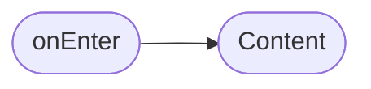
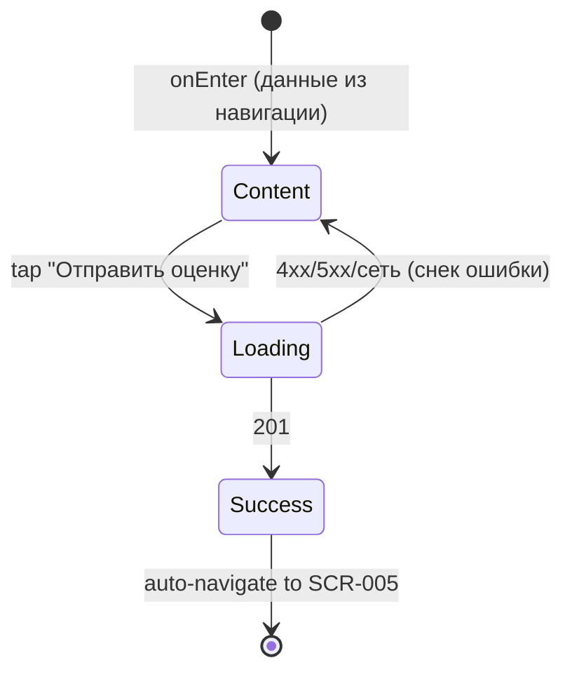

# Оценка мастера

**ID:** SCR-007  
**Тип:** Экран  
**Домен:** 04. Оценки  
**Приоритет:** Medium  
**Статус:** Актуален  
**Функциональные блоки:** FT-07  
**Зона авторизации:** АЗ  
**Дизайн-макет:** —

---

## Содержание

- [История изменений](#история-изменений)
- [Обзор](#обзор)
- [Навигация](#навигация)
- [Входные данные](#входные-данные)
- [Применяемые логики](#применяемые-логики)
- [Инициализация](#инициализация)
- [Используемые запросы](#используемые-запросы)
- [Макет экрана](#макет-экрана)
- [Элементы экрана](#элементы-экрана)
- [Состояния экрана](#состояния-экрана)
- [Действия пользователя](#действия-пользователя)
- [Связанные требования](#связанные-требования)
- [Критерии приёмки](#критерии-приёмки)

---

## История изменений

| Релиз | ТЗ | Описание изменений |
|-------|-----|-------------------|
| 1.0.0 | [ТЗ на мобильное приложение гончарной мастерской](./_INDEX.md) | Первоначальная документация |

---

## Обзор

Экран оценки мастера по 5-звёздочной шкале после завершённого занятия. Содержит информацию о мастере, дате и программе посещения, а также интерактивный рейтинг. Оценка отправляется через POST /ratings и доступна только в окне от 1 до 48 часов после окончания слота. Пользователь попадает на экран с кнопки "Оценить" на экране моих записей.

### User Story

> Как клиент, я хочу оценить мастера после занятия, чтобы поделиться впечатлениями.

### Бизнес-ценность

- Формирует рейтинг мастеров для помощи другим клиентам с выбором
- Мотивирует мастеров поддерживать качество услуг
- Собирает обратную связь для улучшения сервиса

---

## Навигация

### Входящая (откуда открывается)

| Источник | Триггер | Условие | Передаваемые параметры |
|----------|---------|---------|------------------------|
| [SCR-005 Мои записи](./SCR-005_Мои_записи.md) | Тап на кнопку "Оценить" | Слот завершён (`endTime < now`) И статус брони = "активна" И оценка ещё не оставлена | `masterId`, `slotId`, `masterName`, `programName`, `slotDate` |

### Исходящая (куда ведёт)

| Назначение | Триггер | Передаваемые параметры |
|------------|---------|------------------------|
| [SCR-005 Мои записи](./SCR-005_Мои_записи.md) | Успешная отправка оценки | — |

---

## Входные данные

| Название | Тип | Возможные значения | Описание |
|----------|-----|-------------------|----------|
| `masterId` | Состояние | `int` | ID мастера из данных брони (из навигации) |
| `slotId` | Состояние | `int` | ID слота из данных брони (из навигации) |
| `masterName` | Состояние | `string` | Имя мастера для отображения (из навигации) |
| `programName` | Состояние | `string` | Название программы для отображения (из навигации) |
| `slotDate` | Состояние | `string` | Дата посещения для отображения (из навигации) |

---

## Применяемые логики

| Логика | Элемент/Триггер | Описание |
|--------|-----------------|----------|
| [LOGIC-003 Оценка мастера](../09_Логики/LOGIC-003_Оценка_мастера.md) | Кнопка "Отправить оценку" | Проверка окна оценки (1–48 ч), отправка POST /ratings, обработка ответов 201/400/401/422 |

---

## Инициализация

### Диаграмма загрузки



### Запросы при открытии

| № | Запрос | Критичный | Зависит от | Условие |
|---|--------|-----------|------------|---------|
| — | — | — | — | Данные приходят с предыдущего экрана через параметры навигации. Запросы при открытии не выполняются. |

---

## Используемые запросы

### POST /ratings

**Тип:** REST  
**Метод:** POST  
**Спецификация:** [openapi.yaml](../../api/openapi.yaml) → `createRating`

**Триггер:** Тап на кнопку "Отправить оценку" (при выбранной оценке 1–5)

**Параметры:**

| Параметр | Тип | Обязательность | Источник | Описание |
|----------|-----|----------------|----------|----------|
| `masterId` | int | Да | `masterId` из входных данных (навигация) | ID мастера |
| `slotId` | int | Да | `slotId` из входных данных (навигация) | ID слота |
| `score` | int | Да | Выбранное значение звёзд (1–5) | Оценка мастера |

**Обработка ответа:**

| Результат | Условие | UI-реакция |
|-----------|---------|------------|
| Загрузка | — | Лоадер на кнопке "Отправить оценку", блокировка кнопки |
| Успех | 201 | Снек "Спасибо за оценку!", переход на [SCR-005](./SCR-005_Мои_записи.md) через 2 сек |
| HTTP 4xx | 400 | Снек с текстом ошибки из `message` |
| HTTP 4xx | 401 | Снек "Неавторизованный доступ. Выполните вход" |
| HTTP 4xx | 422 | Снек "Оценка доступна в окне от 1 до 48 часов после окончания занятия" |
| HTTP 5xx | — | Снек "Произошла ошибка. Попробуйте позже" |
| Сеть | Нет соединения | Снек "Нет соединения. Проверьте подключение" |

---

## Макет экрана

### Структура

```
┌─────────────────────────────────────┐
│ [←] Оценка мастера                  │  ← Header
├─────────────────────────────────────┤
│                                     │
│          [Фото мастера]             │
│                                     │
│           Иван Иванов               │  ← Имя мастера
│                                     │
│   Гончарный круг · 12 мая 2026     │  ← Программа + дата
│                                     │
│        ★ ★ ★ ★ ★                    │  ← 5 звёзд (тапом)
│                                     │
│     [  Отправить оценку  ]          │  ← Primary button
│                                     │
└─────────────────────────────────────┘
```

### Компоненты

| Компонент | Описание | Обязательность |
|-----------|----------|----------------|
| Фото мастера | Круглое фото мастера (из параметров) | Да |
| Имя мастера | Текст имени мастера (из параметров) | Да |
| Блок программы и даты | Название программы + дата посещения (из параметров) | Да |
| Ряд звёзд | 5 звёзд для выбора оценки (тапом выбирается значение 1–5) | Да |
| Кнопка "Отправить оценку" | Primary button; активна только при выбранной оценке | Да |

---

## Элементы экрана

### 1. Информация о мастере и посещении

| Элемент | Описание | Источник данных | Валидация | Действие |
|---------|----------|-----------------|-----------|----------|
| Фото мастера | Круглое фото мастера (аватар) | `masterPhoto` из параметров навигации | — | — |
| Имя мастера | Имя и фамилия мастера | `masterName` из параметров навигации | — | — |
| Программа + дата | Строка вида "{programName} · {slotDate}" | `programName`, `slotDate` из параметров навигации | — | — |

### 2. Выбор оценки

| Элемент | Описание | Источник данных | Валидация | Действие |
|---------|----------|-----------------|-----------|----------|
| Звезда 1 | Первая звезда (оценка 1) | — | — | Тап → выбор score = 1, визуальное выделение всех звёзд до 1 |
| Звезда 2 | Вторая звезда (оценка 2) | — | — | Тап → выбор score = 2, визуальное выделение всех звёзд до 2 |
| Звезда 3 | Третья звезда (оценка 3) | — | — | Тап → выбор score = 3, визуальное выделение всех звёзд до 3 |
| Звезда 4 | Четвёртая звезда (оценка 4) | — | — | Тап → выбор score = 4, визуальное выделение всех звёзд до 4 |
| Звезда 5 | Пятая звезда (оценка 5) | — | — | Тап → выбор score = 5, визуальное выделение всех звёзд до 5 |

**Логика:**
- Звёзды: При тапе на звезду N устанавливается `score = N`. Все звёзды от 1 до N отображаются залитыми (выбранными), звёзды от N+1 до 5 — пустыми (невыбранными). Повторный тап на ту же звезду сбрасывает оценку (score = null).

### 3. Кнопка отправки

| Элемент | Описание | Источник данных | Валидация | Действие |
|---------|----------|-----------------|-----------|----------|
| Кнопка "Отправить оценку" | Primary button | — | — | [POST /ratings](#post-ratings) |

**Условия доступности:**
- Кнопка "Отправить оценку" активна, если: `score` выбран (значение от 1 до 5)
- Кнопка "Отправить оценку" неактивна, если: `score = null` (оценка не выбрана)

---

## Состояния экрана

### Таблица состояний

| Состояние | Условие | Отображение |
|-----------|---------|-------------|
| Content | — | Стандартный контент: информация о мастере, звёзды, кнопка |
| Loading | Ожидание ответа POST /ratings | Лоадер на кнопке "Отправить оценку", кнопка заблокирована |
| Success | HTTP 201 | Снек "Спасибо за оценку!" → автоматический переход на [SCR-005](./SCR-005_Мои_записи.md) |
| Error | HTTP 4xx/5xx/сеть | Снек с текстом ошибки, кнопка разблокирована |

### Диаграмма переходов



---

## Действия пользователя

| Действие | Элемент | Триггер | Результат |
|----------|---------|---------|-----------|
| Выбрать оценку | Звезда 1–5 | Tap | Установка `score`, визуальное выделение звёзд |
| Отправить оценку | Кнопка "Отправить оценку" | Tap | [POST /ratings](#post-ratings) → снек успеха → переход на SCR-005 |
| Вернуться | Кнопка "←" (Header) | Tap | Возврат на [SCR-005](./SCR-005_Мои_записи.md) |

---

## Связанные требования

### Функциональные (REQ-FUNC-*)

| ID | Название | Приоритет |
|----|----------|-----------|
| FT-07 | Оценка мастера | Medium |

### Интеграции (REQ-INT-*)

| ID | Название | Приоритет |
|----|----------|-----------|
| REQ-INT-001 | API аутентификации | Critical |
| REQ-INT-007 | API оценок | Medium |

### UI (REQ-UI-*)

| ID | Название | Приоритет |
|----|----------|-----------|
| REQ-UI-010 | Компонент "Рейтинг (звёзды)" | Medium |

---

## Критерии приёмки

### Позитивные сценарии

| ID | Критерий | Приоритет |
|----|----------|-----------|
| AC-001 | **Дано** клиент на экране оценки мастера, **Когда** выбрана оценка (1–5) и нажата кнопка "Отправить оценку", **Тогда** POST /ratings возвращает 201, отображается снек "Спасибо за оценку!", через 2 сек — переход на SCR-005 | P0 |

### Негативные сценарии

| ID | Критерий | Приоритет |
|----|----------|-----------|
| AC-N01 | **Дано** оценка не выбрана (score = null), **Когда** экран открыт, **Тогда** кнопка "Отправить оценку" неактивна | P0 |
| AC-N02 | **Дано** отправка POST /ratings, **Когда** сервер возвращает 422, **Тогда** отображается снек "Оценка доступна в окне от 1 до 48 часов после окончания занятия" | P1 |
| AC-N03 | **Дано** отправка POST /ratings, **Когда** сервер возвращает 400, **Тогда** отображается снек с текстом ошибки из ответа сервера | P1 |
| AC-N04 | **Дано** отправка POST /ratings, **Когда** сервер возвращает 401, **Тогда** отображается снек "Неавторизованный доступ. Выполните вход" | P1 |
| AC-N05 | **Дано** отправка POST /ratings, **Когда** нет соединения с сетью, **Тогда** отображается снек "Нет соединения. Проверьте подключение" | P1 |

### Граничные условия (Edge Cases)

| ID | Критерий | Приоритет |
|----|----------|-----------|
| AC-E01 | **Дано** повторный тап на ту же выбранную звезду, **Когда** оценка уже выбрана, **Тогда** оценка сбрасывается (score = null), кнопка становится неактивной | P2 |
| AC-E02 | **Дано** быстрый двойной тап на кнопку "Отправить оценку", **Когда** после первого тапа, **Тогда** повторный запрос не отправляется (кнопка заблокирована лоадером) | P2 |
