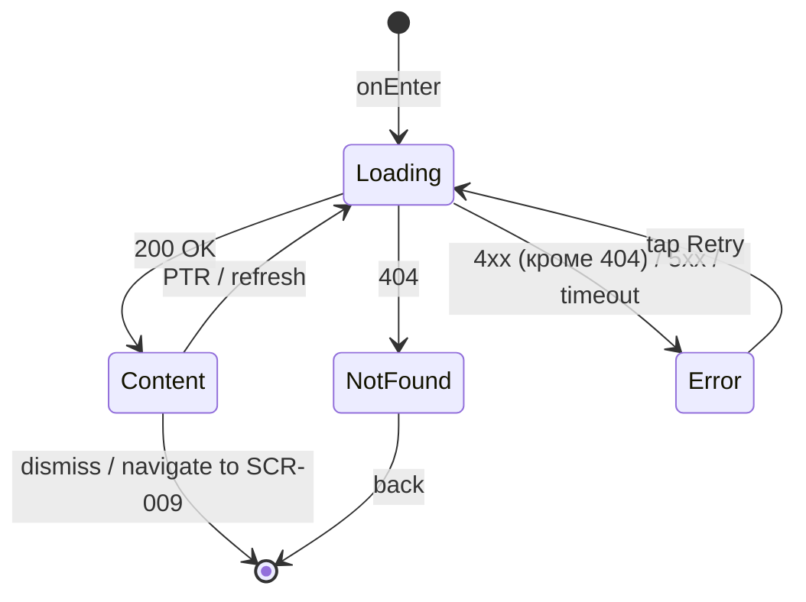

# Профиль мастера

**ID:** SCR-008  
**Тип:** Экран  
**Домен:** 05. Мастера  
**Приоритет:** Medium  
**Статус:** Актуален  
**Функциональные блоки:** FT-09  
**Зона авторизации:** НЗ + АЗ  
**Дизайн-макет:** —

---

## Содержание

- [История изменений](#история-изменений)
- [Обзор](#обзор)
- [Навигация](#навигация)
- [Входные данные](#входные-данные)
- [Применяемые логики](#применяемые-логики)
- [Инициализация](#инициализация)
- [Используемые запросы](#используемые-запросы)
- [Макет экрана](#макет-экрана)
- [Элементы экрана](#элементы-экрана)
- [Состояния экрана](#состояния-экрана)
- [Действия пользователя](#действия-пользователя)
- [Связанные требования](#связанные-требования)
- [Критерии приёмки](#критерии-приёмки)

---

## История изменений

| Релиз | ТЗ | Описание изменений |
|-------|-----|-------------------|
| 1.0.0 | [ТЗ на мобильное приложение гончарной мастерской](./_INDEX.md) | Первоначальная документация |

---

## Обзор

Экран просмотра подробной информации о мастере. Содержит крупное фото, имя, уровень мастерства, рейтинг и список программ, которые ведёт мастер. Доступен как авторизованным, так и неавторизованным пользователям (НЗ + АЗ). Переход на экран осуществляется тапом по имени/фото мастера из расписания, деталей слота, деталей брони или из программы.

### User Story

> Как клиент, я хочу посмотреть профиль мастера, чтобы узнать о его квалификации и выбранных программах.

### Бизнес-ценность

- Помогает клиентам сделать осознанный выбор мастера
- Повышает доверие к сервису через прозрачность информации о мастерах
- Увеличивает конверсию в бронирование за счёт детальной информации

---

## Навигация

### Входящая (откуда открывается)

| Источник | Триггер | Условие | Передаваемые параметры |
|----------|---------|---------|------------------------|
| [SCR-003 Расписание](./SCR-003_Расписание.md) | Тап по имени/фото мастера | Всегда | `masterId` |
| [SCR-004 Детали слота](./SCR-004_Детали_слота.md) | Тап по имени/фото мастера | Всегда | `masterId` |
| [SCR-006 Детали брони](./SCR-006_Детали_брони.md) | Тап по имени/фото мастера | Всегда | `masterId` |
| [SCR-009 Программа](./SCR-009_Программа.md) | Тап по имени мастера в списке | Всегда | `masterId` |

### Исходящая (куда ведёт)

| Назначение | Триггер | Передаваемые параметры |
|------------|---------|------------------------|
| [SCR-009 Программа](./SCR-009_Программа.md) | Тап по названию программы в списке | `programId` |

---

## Входные данные

| Название | Тип | Возможные значения | Описание |
|----------|-----|-------------------|----------|
| `masterId` | Состояние | `int` | ID мастера (из навигации) |

---

## Применяемые логики

| Логика | Элемент/Триггер | Описание |
|--------|-----------------|----------|
| — | — | Переиспользуемые логики не применяются |

---

## Инициализация

### Диаграмма загрузки

```mermaid
flowchart LR
    Start([onEnter]) --> GetMaster[GET /masters/{masterId}]
    GetMaster --> Ready([Content])
```

### Запросы при открытии

| № | Запрос | Критичный | Зависит от | Условие |
|---|--------|-----------|------------|---------|
| 1 | [GET /masters/{masterId}](#get-mastersmasterid) | Да | — | Всегда |

---

## Используемые запросы

### GET /masters/{masterId}

**Тип:** REST  
**Метод:** GET  
**Спецификация:** [openapi.yaml](../../api/openapi.yaml) → `getMasterById`

**Триггер:** Инициализация (onEnter)

**Параметры:**

| Параметр | Тип | Обязательность | Источник | Описание |
|----------|-----|----------------|----------|----------|
| `masterId` | int | Да | `masterId` из навигации | ID мастера |

**Обработка ответа:**

| Результат | Условие | UI-реакция |
|-----------|---------|------------|
| Загрузка | — | Скелетон-шиммер |
| Успех | 200 + `data` не пуст | Отобразить профиль мастера |
| HTTP 4xx | 404 | Error state: "Мастер не найден" |
| HTTP 4xx | 4xx (кроме 404) | Error state с кнопкой "Обновить" |
| HTTP 5xx | — | Error state с кнопкой "Обновить" |
| Сеть | Нет соединения | Error state с кнопкой "Обновить" |

---

## Макет экрана

### Структура

```
┌─────────────────────────────────────┐
│ [←]                         [︙]    │  ← Header
├─────────────────────────────────────┤
│                                     │
│       ┌───────────────────┐         │
│       │                   │         │
│       │   Крупное фото    │         │  ← Scrollable
│       │     мастера       │         │
│       │                   │         │
│       └───────────────────┘         │
│                                     │
│         Иван Иванов                 │  ← Имя (крупно)
│                                     │
│      [ Опытный ]  ★ 4.8            │  ← Бейдж уровня + рейтинг
│                                     │
│   ──── Программы мастера ────       │
│                                     │
│   • Гончарный круг                 │
│   • Лепка для начинающих           │  → тап → SCR-009
│   • Роспись керамики               │
│                                     │
└─────────────────────────────────────┘
```

### Компоненты

| Компонент | Описание | Обязательность |
|-----------|----------|----------------|
| Фото мастера | Крупное фото мастера (на всю ширину или большая круглая) | Да |
| Имя мастера | Имя и фамилия мастера крупным шрифтом | Да |
| Бейдж уровня | Цветной бейдж "новичок" / "опытный" | Да |
| Рейтинг | Числовой рейтинг (1.0–5.0) + отображение звёздами | Да |
| Список программ | Список названий программ мастера (тап → SCR-009) | Да |

---

## Элементы экрана

### 1. Шапка профиля

| Элемент | Описание | Источник данных | Валидация | Действие |
|---------|----------|-----------------|-----------|----------|
| Фото мастера | Крупное фото (аватар) мастера | `photo` из [GET /masters/{masterId}](#get-mastersmasterid) | — | — |
| Имя мастера | Имя и фамилия | `name` из [GET /masters/{masterId}](#get-mastersmasterid) | — | — |

### 2. Уровень и рейтинг

| Элемент | Описание | Источник данных | Валидация | Действие |
|---------|----------|-----------------|-----------|----------|
| Бейдж уровня | Цветной бейдж: "новичок" (зелёный) или "опытный" (золотой) | `level` из [GET /masters/{masterId}](#get-mastersmasterid) | — | — |
| Рейтинг (число) | Число с одним знаком после запятой (например, 4.8) | `rating` из [GET /masters/{masterId}](#get-mastersmasterid) | — | — |
| Рейтинг (звёзды) | Отображение рейтинга в виде заполненных/пустых звёзд (5 звёзд, где заполнено = `rating` / 5) | `rating` из [GET /masters/{masterId}](#get-mastersmasterid) | — | — |

### 3. Программы мастера

| Элемент | Описание | Источник данных | Валидация | Действие |
|---------|----------|-----------------|-----------|----------|
| Заголовок "Программы мастера" | Секционный заголовок | — | — | — |
| Список программ | Список названий программ, которые ведёт мастер. Каждый элемент — тапабельная строка | `programIds` из [GET /masters/{masterId}](#get-mastersmasterid) → названия из [GET /programs](#get-programprogramid) (загружаются по отдельности) | — | Тап → [SCR-009 Программа](./SCR-009_Программа.md) с `programId` |

**Логика:**
- Список программ: Для каждого `programId` из `master.programIds` выполняется `GET /programs/{programId}` для получения названия. Названия кэшируются — при повторном открытии профиля того же мастера запросы не дублируются.
- Если ни одна программа не загружена — секция не отображается.

---

## Состояния экрана

### Таблица состояний

| Состояние | Условие | Отображение |
|-----------|---------|-------------|
| Loading | Ожидание GET /masters/{masterId} | Скелетон-шиммер |
| Content | 200 + `data` не пуст | Стандартный контент (фото, имя, уровень, рейтинг, программы) |
| Error | 4xx (кроме 404) / 5xx / сеть | Error state с текстом "Произошла ошибка" и кнопкой "Обновить" |
| NotFound | 404 | Error state с текстом "Мастер не найден" (без кнопки Retry) |

### Диаграмма переходов



---

## Действия пользователя

| Действие | Элемент | Триггер | Результат |
|----------|---------|---------|-----------|
| Открыть программу | Название программы в списке | Tap | Переход на [SCR-009 Программа](./SCR-009_Программа.md) с `programId` |
| Вернуться | Кнопка "←" (Header) | Tap | Возврат на предыдущий экран |
| Обновить | Кнопка "Обновить" | Tap | Повторный GET /masters/{masterId} |

---

## Связанные требования

### Функциональные (REQ-FUNC-*)

| ID | Название | Приоритет |
|----|----------|-----------|
| FT-09 | Мастера | Medium |

### Интеграции (REQ-INT-*)

| ID | Название | Приоритет |
|----|----------|-----------|
| REQ-INT-009 | API мастеров | Medium |
| REQ-INT-010 | API программ | Medium |

### UI (REQ-UI-*)

| ID | Название | Приоритет |
|----|----------|-----------|
| REQ-UI-010 | Компонент "Рейтинг (звёзды)" | Medium |
| REQ-UI-011 | Компонент "Бейдж уровня" | Medium |

---

## Критерии приёмки

### Позитивные сценарии

| ID | Критерий | Приоритет |
|----|----------|-----------|
| AC-001 | **Дано** мастер с `masterId` существует, **Когда** пользователь открывает экран, **Тогда** отображается профиль мастера: фото, имя, уровень, рейтинг, список программ | P0 |

### Негативные сценарии

| ID | Критерий | Приоритет |
|----|----------|-----------|
| AC-N01 | **Дано** `masterId` не существует, **Когда** GET /masters/{masterId} возвращает 404, **Тогда** отображается Error state с текстом "Мастер не найден" | P0 |
| AC-N02 | **Дано** ошибка сервера (5xx) или сети, **Когда** GET /masters/{masterId}, **Тогда** отображается Error state с кнопкой "Обновить" | P1 |
| AC-N03 | **Дано** мастер не имеет ни одной программы (пустой `programIds`), **Когда** профиль загружен, **Тогда** секция "Программы мастера" не отображается | P1 |

### Граничные условия (Edge Cases)

| ID | Критерий | Приоритет |
|----|----------|-----------|
| AC-E01 | **Дано** потеря сети во время загрузки профиля, **Когда** сеть восстановлена, **Тогда** пользователь может нажать "Обновить" для повторного запроса | P2 |
