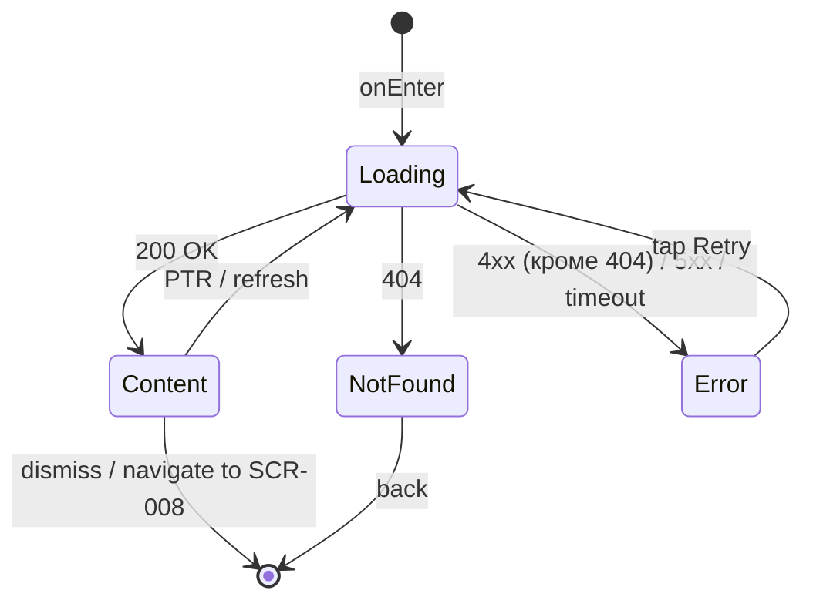

# Программа мастер-класса

**ID:** SCR-009  
**Тип:** Экран  
**Домен:** 06. Программы  
**Приоритет:** Medium  
**Статус:** Актуален  
**Функциональные блоки:** FT-10  
**Зона авторизации:** НЗ + АЗ  
**Дизайн-макет:** —

---

## Содержание

- [История изменений](#история-изменений)
- [Обзор](#обзор)
- [Навигация](#навигация)
- [Входные данные](#входные-данные)
- [Применяемые логики](#применяемые-логики)
- [Инициализация](#инициализация)
- [Используемые запросы](#используемые-запросы)
- [Макет экрана](#макет-экрана)
- [Элементы экрана](#элементы-экрана)
- [Состояния экрана](#состояния-экрана)
- [Действия пользователя](#действия-пользователя)
- [Связанные требования](#связанные-требования)
- [Критерии приёмки](#критерии-приёмки)

---

## История изменений

| Релиз | ТЗ | Описание изменений |
|-------|-----|-------------------|
| 1.0.0 | [ТЗ на мобильное приложение гончарной мастерской](./_INDEX.md) | Первоначальная документация |

---

## Обзор

Экран детального описания программы мастер-класса. Содержит название, полное описание, максимальную вместимость и список мастеров, ведущих данную программу. Доступен как авторизованным, так и неавторизованным пользователям. Переход осуществляется тапом по программе из расписания, деталей слота или профиля мастера.

### User Story

> Как клиент, я хочу узнать о программе мастер-класса, чтобы понять, подходит ли она мне.

### Бизнес-ценность

- Даёт клиенту полную информацию о программе перед бронированием
- Снижает количество отмен из-за несоответствия ожиданий
- Повышает конверсию в бронирование через детальное описание

---

## Навигация

### Входящая (откуда открывается)

| Источник | Триггер | Условие | Передаваемые параметры |
|----------|---------|---------|------------------------|
| [SCR-003 Расписание](./SCR-003_Расписание.md) | Тап по карточке программы | Всегда | `programId` |
| [SCR-004 Детали слота](./SCR-004_Детали_слота.md) | Тап по названию программы | Всегда | `programId` |
| [SCR-008 Профиль мастера](./SCR-008_Профиль_мастера.md) | Тап по программе в списке | Всегда | `programId` |

### Исходящая (куда ведёт)

| Назначение | Триггер | Передаваемые параметры |
|------------|---------|------------------------|
| [SCR-008 Профиль мастера](./SCR-008_Профиль_мастера.md) | Тап по имени мастера в списке | `masterId` |

---

## Входные данные

| Название | Тип | Возможные значения | Описание |
|----------|-----|-------------------|----------|
| `programId` | Состояние | `int` | ID программы (из навигации) |

---

## Применяемые логики

| Логика | Элемент/Триггер | Описание |
|--------|-----------------|----------|
| — | — | Переиспользуемые логики не применяются |

---

## Инициализация

### Диаграмма загрузки

```mermaid
flowchart LR
    Start([onEnter]) --> GetProgram[GET /programs/{programId}]
    GetProgram --> Ready([Content])
```

### Запросы при открытии

| № | Запрос | Критичный | Зависит от | Условие |
|---|--------|-----------|------------|---------|
| 1 | [GET /programs/{programId}](#get-programsprogramid) | Да | — | Всегда |

---

## Используемые запросы

### GET /programs/{programId}

**Тип:** REST  
**Метод:** GET  
**Спецификация:** [openapi.yaml](../../api/openapi.yaml) → `getProgramById`

**Триггер:** Инициализация (onEnter)

**Параметры:**

| Параметр | Тип | Обязательность | Источник | Описание |
|----------|-----|----------------|----------|----------|
| `programId` | int | Да | `programId` из навигации | ID программы |

**Обработка ответа:**

| Результат | Условие | UI-реакция |
|-----------|---------|------------|
| Загрузка | — | Скелетон-шиммер |
| Успех | 200 + `data` не пуст | Отобразить данные программы |
| HTTP 4xx | 404 | Error state: "Программа не найдена" |
| HTTP 4xx | 4xx (кроме 404) | Error state с кнопкой "Обновить" |
| HTTP 5xx | — | Error state с кнопкой "Обновить" |
| Сеть | Нет соединения | Error state с кнопкой "Обновить" |

---

## Макет экрана

### Структура

```
┌─────────────────────────────────────┐
│ [←]                         [︙]    │  ← Header
├─────────────────────────────────────┤
│                                     │
│      Гончарный круг                 │  ← Название (крупно)
│                                     │
│   На занятии вы познакомитесь с     │  ← Описание
│   основами работы за гончарным      │
│   кругом и создадите изделие...     │
│                                     │
│   ──── Вместимость ────             │
│   Макс. 10 чел.                     │  ← maxCapacity с пояснением
│   (гончарный круг ≤ 10 чел.)        │
│                                     │
│   ──── Мастера ────                 │
│   • Иван Иванов          [→]       │  → тап → SCR-008
│   • Анна Петрова         [→]       │
│                                     │
└─────────────────────────────────────┘
```

### Компоненты

| Компонент | Описание | Обязательность |
|-----------|----------|----------------|
| Название программы | Крупный заголовок с названием | Да |
| Описание | Полный текст описания программы | Да |
| Блок вместимости | Максимальная вместимость с пояснением по типам программ | Да |
| Список мастеров | Список мастеров, ведущих программу (тап → SCR-008) | Да |

---

## Элементы экрана

### 1. Основная информация

| Элемент | Описание | Источник данных | Валидация | Действие |
|---------|----------|-----------------|-----------|----------|
| Название программы | Крупный заголовок | `name` из [GET /programs/{programId}](#get-programsprogramid) | — | — |
| Описание программы | Полный текст описания (multiline) | `description` из [GET /programs/{programId}](#get-programsprogramid) | — | — |

### 2. Вместимость

| Элемент | Описание | Источник данных | Валидация | Действие |
|---------|----------|-----------------|-----------|----------|
| Заголовок "Вместимость" | Секционный заголовок | — | — | — |
| Максимальная вместимость | Число человек, например "Макс. 10 чел." | `maxCapacity` из [GET /programs/{programId}](#get-programsprogramid) | — | — |
| Пояснение | Текст-подсказка: "Новичковые программы: ≤ 6 чел., гончарный круг: ≤ 10 чел." | — | — | — |

**Логика:**
- Пояснение отображается всегда как справочная информация о лимитах программ разных типов. Фактическая вместимость конкретной программы берётся из `maxCapacity`.

### 3. Мастера программы

| Элемент | Описание | Источник данных | Валидация | Действие |
|---------|----------|-----------------|-----------|----------|
| Заголовок "Мастера" | Секционный заголовок | — | — | — |
| Список мастеров | Список имён мастеров, ведущих программу. Каждый элемент — тапабельная строка с именем и стрелкой → | `masterIds` из [GET /programs/{programId}](#get-programsprogramid) → имена из [GET /masters/{masterId}](/api) | — | Тап → [SCR-008 Профиль мастера](./SCR-008_Профиль_мастера.md) с `masterId` |

**Логика:**
- Список мастеров: Для каждого `masterId` из `program.masterIds` выполняется `GET /masters/{masterId}` для получения имени. Имена кэшируются.
- Если ни один мастер не загружен или список `masterIds` пуст — секция не отображается.

---

## Состояния экрана

### Таблица состояний

| Состояние | Условие | Отображение |
|-----------|---------|-------------|
| Loading | Ожидание GET /programs/{programId} | Скелетон-шиммер |
| Content | 200 + `data` не пуст | Стандартный контент (название, описание, вместимость, мастера) |
| Error | 4xx (кроме 404) / 5xx / сеть | Error state с текстом "Произошла ошибка" и кнопкой "Обновить" |
| NotFound | 404 | Error state с текстом "Программа не найдена" (без кнопки Retry) |

### Диаграмма переходов



---

## Действия пользователя

| Действие | Элемент | Триггер | Результат |
|----------|---------|---------|-----------|
| Открыть профиль мастера | Имя мастера в списке | Tap | Переход на [SCR-008 Профиль мастера](./SCR-008_Профиль_мастера.md) с `masterId` |
| Вернуться | Кнопка "←" (Header) | Tap | Возврат на предыдущий экран |
| Обновить | Кнопка "Обновить" | Tap | Повторный GET /programs/{programId} |

---

## Связанные требования

### Функциональные (REQ-FUNC-*)

| ID | Название | Приоритет |
|----|----------|-----------|
| FT-10 | Программы | Medium |

### Интеграции (REQ-INT-*)

| ID | Название | Приоритет |
|----|----------|-----------|
| REQ-INT-010 | API программ | Medium |
| REQ-INT-009 | API мастеров | Medium |

### UI (REQ-UI-*)

| ID | Название | Приоритет |
|----|----------|-----------|
| REQ-UI-012 | Компонент "Карточка вместимости" | Medium |

---

## Критерии приёмки

### Позитивные сценарии

| ID | Критерий | Приоритет |
|----|----------|-----------|
| AC-001 | **Дано** программа с `programId` существует, **Когда** пользователь открывает экран, **Тогда** отображается название, описание, вместимость и список мастеров | P0 |

### Негативные сценарии

| ID | Критерий | Приоритет |
|----|----------|-----------|
| AC-N01 | **Дано** `programId` не существует, **Когда** GET /programs/{programId} возвращает 404, **Тогда** отображается Error state с текстом "Программа не найдена" | P0 |
| AC-N02 | **Дано** ошибка сервера (5xx) или сети, **Когда** GET /programs/{programId}, **Тогда** отображается Error state с кнопкой "Обновить" | P1 |
| AC-N03 | **Дано** программа не имеет мастеров (пустой `masterIds`), **Когда** данные загружены, **Тогда** секция "Мастера" не отображается | P1 |

### Граничные условия (Edge Cases)

| ID | Критерий | Приоритет |
|----|----------|-----------|
| AC-E01 | **Дано** описание программы — длинный текст (> 1000 символов), **Когда** экран открыт, **Тогда** описание отображается полностью с возможностью скролла | P2 |
